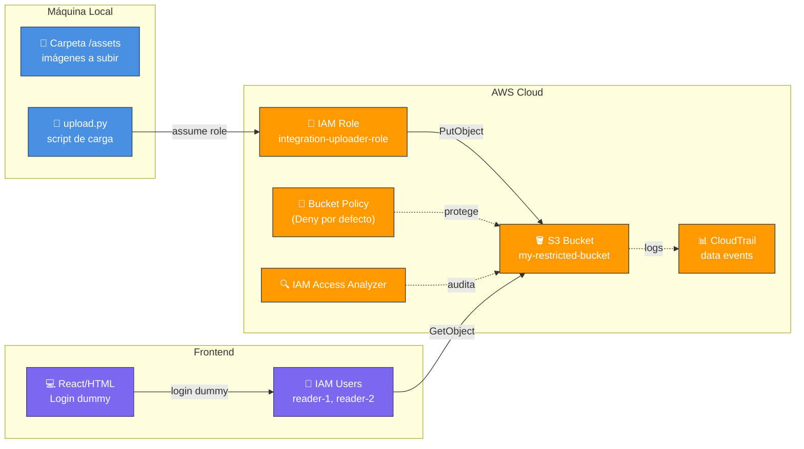
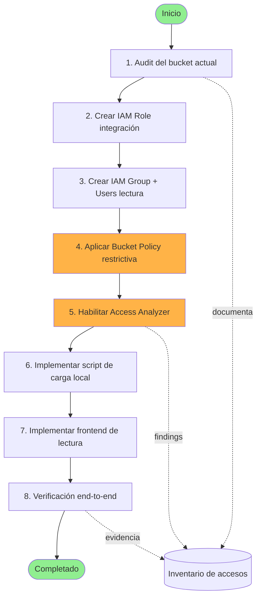
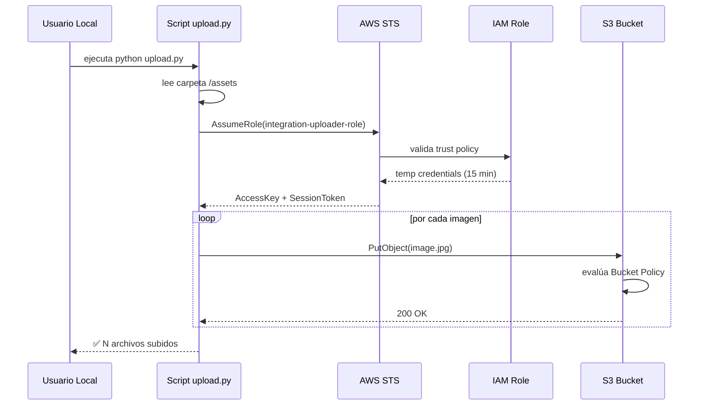
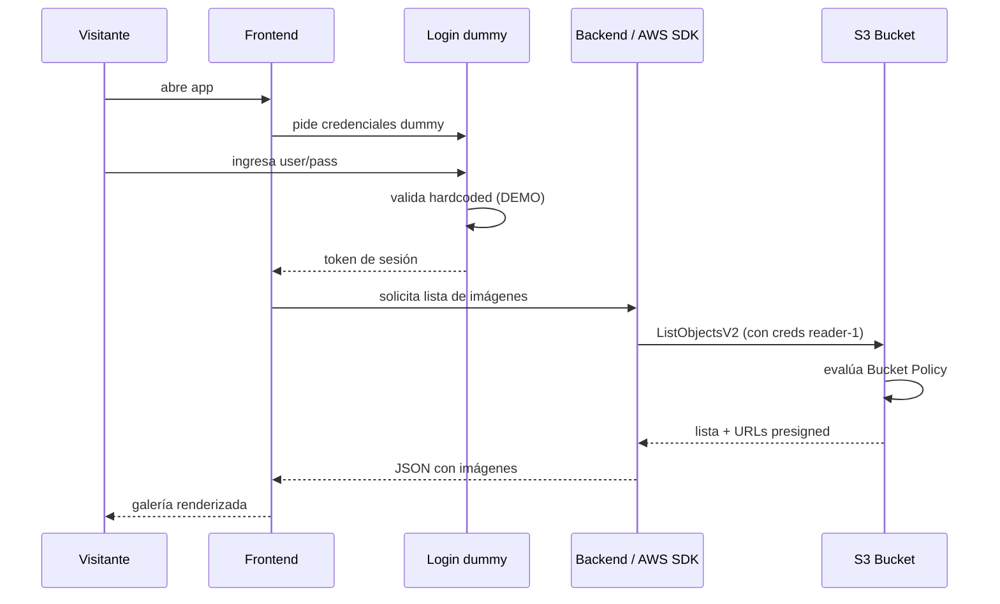
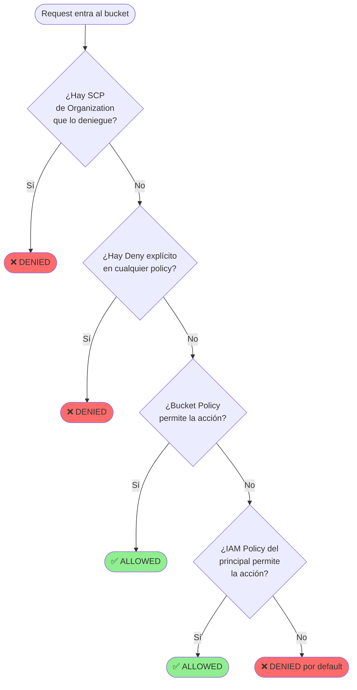
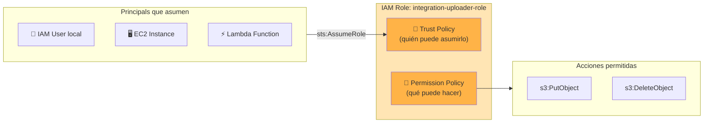
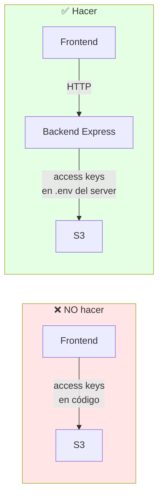

# AWS S3 Restricted Bucket Integration Guide

> Guía completa para configurar un bucket S3 con acceso restringido, un script de carga automatizada desde local, y un frontend de lectura. Cubre tanto **AWS CLI** como **AWS Console UI** en paralelo.

---

## Tabla de Contenidos

1. [Resumen del Ejercicio](#1-resumen-del-ejercicio)
2. [Arquitectura del Sistema](#2-arquitectura-del-sistema)
3. [Flujo de Implementación](#3-flujo-de-implementación)
4. [Modelo de Permisos a Profundidad](#4-modelo-de-permisos-a-profundidad)
5. [Pre-requisitos](#5-pre-requisitos)
6. [Fase 1 — Auditar accesos actuales del bucket](#6-fase-1--auditar-accesos-actuales-del-bucket)
7. [Fase 2 — Crear el IAM Role de integración](#7-fase-2--crear-el-iam-role-de-integración)
8. [Fase 3 — Crear usuarios de lectura](#8-fase-3--crear-usuarios-de-lectura)
9. [Fase 4 — Bucket Policy restrictiva](#9-fase-4--bucket-policy-restrictiva)
10. [Fase 5 — Habilitar IAM Access Analyzer](#10-fase-5--habilitar-iam-access-analyzer)
11. [Fase 6 — Script local de carga](#11-fase-6--script-local-de-carga)
12. [Fase 7 — Frontend de lectura](#12-fase-7--frontend-de-lectura)
13. [Fase 8 — Verificación end-to-end](#13-fase-8--verificación-end-to-end)
14. [Referencias documentales AWS](#14-referencias-documentales-aws)
15. [Plan para Claude Code Agent](#15-plan-para-claude-code-agent)

---

## 1. Resumen del Ejercicio

### Objetivos

- **Auditar** quién y qué tiene acceso al bucket actualmente.
- **Restringir escritura** únicamente al servicio de integración (un IAM Role).
- **Restringir lectura** únicamente a un set específico de usuarios IAM.
- **Cargar imágenes** desde una carpeta local al bucket vía script.
- **Visualizar contenido** del bucket desde un frontend simple con login dummy.

### Approach elegido — Opción C (Access Analyzer + Governance)

Esta opción se eligió por:

- Audit automático y continuo de exposición del bucket.
- Findings centralizados en IAM Access Analyzer.
- Trazabilidad vía CloudTrail y server access logs.
- Escala mejor cuando crece el equipo.

---

## 2. Arquitectura del Sistema



### Componentes

| Componente | Tipo | Propósito |
|---|---|---|
| `my-restricted-bucket` | S3 Bucket | Almacena las imágenes |
| `integration-uploader-role` | IAM Role | Identidad que puede escribir |
| `s3-readers` | IAM Group | Contenedor de usuarios de lectura |
| `reader-1`, `reader-2` | IAM Users | Cuentas con acceso de lectura |
| Bucket Policy | Recurso S3 | Aplica el modelo deny-by-default |
| Access Analyzer | Servicio IAM | Detecta exposición no intencionada |

---

## 3. Flujo de Implementación



### Flujo de autenticación del script de carga



### Flujo de lectura del frontend



---

## 4. Modelo de Permisos a Profundidad

### 4.1 Cómo evalúa AWS un request a S3

Esta es la parte más importante del ejercicio. AWS evalúa cada request siguiendo un orden estricto:



**Regla de oro:** un `Deny` explícito **siempre** gana. Por eso nuestra estrategia es construir una bucket policy con `Deny` para `Principal: "*"` y excepciones vía condición.

### 4.2 Anatomía de un IAM Role



### 4.3 Capas de control que aplicaremos

| Capa | Mecanismo | Qué controla |
|---|---|---|
| 1 | Block Public Access | Bloquea cualquier configuración pública accidental |
| 2 | Bucket Policy con Deny | Niega TODO por default a `Principal: "*"` |
| 3 | Excepciones por ARN | Solo el role de integración escribe; solo readers leen |
| 4 | IAM Policy del Role | Define exactamente qué puede hacer el role |
| 5 | IAM Policy del Group | Define qué pueden hacer los readers |
| 6 | Access Analyzer | Detecta cualquier brecha en las capas 1-5 |
| 7 | CloudTrail Data Events | Registra cada acceso para forensia |

### 4.4 Bucket Policy explicada línea por línea

```json
{
  "Version": "2012-10-17",
  "Statement": [
    {
      "Sid": "DenyAllNonAuthorized",
      "Effect": "Deny",
      "Principal": "*",
      "Action": "s3:*",
      "Resource": [
        "arn:aws:s3:::my-restricted-bucket",
        "arn:aws:s3:::my-restricted-bucket/*"
      ],
      "Condition": {
        "ArnNotLike": {
          "aws:PrincipalArn": [
            "arn:aws:iam::ACCOUNT_ID:role/integration-uploader-role",
            "arn:aws:iam::ACCOUNT_ID:user/reader-1",
            "arn:aws:iam::ACCOUNT_ID:user/reader-2"
          ]
        }
      }
    },
    {
      "Sid": "DenyWriteForReaders",
      "Effect": "Deny",
      "Principal": "*",
      "Action": [
        "s3:PutObject",
        "s3:DeleteObject",
        "s3:PutObjectAcl"
      ],
      "Resource": "arn:aws:s3:::my-restricted-bucket/*",
      "Condition": {
        "ArnNotLike": {
          "aws:PrincipalArn": "arn:aws:iam::ACCOUNT_ID:role/integration-uploader-role"
        }
      }
    },
    {
      "Sid": "EnforceTLS",
      "Effect": "Deny",
      "Principal": "*",
      "Action": "s3:*",
      "Resource": [
        "arn:aws:s3:::my-restricted-bucket",
        "arn:aws:s3:::my-restricted-bucket/*"
      ],
      "Condition": {
        "Bool": {
          "aws:SecureTransport": "false"
        }
      }
    }
  ]
}
```

| Statement | Función |
|---|---|
| `DenyAllNonAuthorized` | Niega TODO para cualquiera que no sea uno de los 3 ARNs autorizados |
| `DenyWriteForReaders` | Aunque los readers están autorizados, no pueden escribir, solo el role |
| `EnforceTLS` | Bloquea conexiones HTTP, solo HTTPS |

---

## 5. Pre-requisitos

### Software local

| Tool | Versión mínima | Verificación |
|---|---|---|
| AWS CLI v2 | 2.x | `aws --version` |
| Python | 3.10+ | `python3 --version` |
| Node.js | 18+ (solo frontend) | `node --version` |
| Git | cualquier versión reciente | `git --version` |

### Cuenta AWS

- Acceso a una cuenta AWS con permisos de administrador para la configuración inicial.
- Bucket S3 ya creado (según el requerimiento original): `my-restricted-bucket`.
- Saber tu **Account ID** de 12 dígitos (lo usarás en todos los ARNs).

### Variables de entorno usadas en esta guía

```bash
export AWS_REGION="us-east-1"
export ACCOUNT_ID="123456789012"      # reemplaza con el tuyo
export BUCKET="my-restricted-bucket"  # reemplaza con el tuyo
export ROLE_NAME="integration-uploader-role"
export GROUP_NAME="s3-readers"
```

---

## 6. Fase 1 — Auditar accesos actuales del bucket

### Objetivo

Documentar el estado actual antes de modificar nada. Generamos un snapshot de:

- Bucket policy existente.
- ACL del bucket.
- Configuración de Block Public Access.
- Lista de IAM users y roles que pudieran tocar el bucket.

### 🖥️ Vía CLI

```bash
# Crear carpeta de evidencia
mkdir -p audit-evidence && cd audit-evidence

# 1. Bucket Policy actual (puede no existir)
aws s3api get-bucket-policy --bucket $BUCKET \
    --query Policy --output text 2>/dev/null \
    | python3 -m json.tool > bucket-policy-before.json \
    || echo "No bucket policy" > bucket-policy-before.json

# 2. ACL del bucket
aws s3api get-bucket-acl --bucket $BUCKET > bucket-acl-before.json

# 3. Block Public Access
aws s3api get-public-access-block --bucket $BUCKET \
    > public-access-block-before.json 2>/dev/null \
    || echo "{}" > public-access-block-before.json

# 4. Object Ownership
aws s3api get-bucket-ownership-controls --bucket $BUCKET \
    > ownership-before.json 2>/dev/null

# 5. Versionado y logging
aws s3api get-bucket-versioning --bucket $BUCKET > versioning-before.json
aws s3api get-bucket-logging --bucket $BUCKET > logging-before.json

# 6. Listar TODOS los IAM users (potenciales accesores)
aws iam list-users \
    --query 'Users[*].[UserName,Arn,CreateDate]' \
    --output table > iam-users.txt

# 7. Listar TODOS los IAM roles
aws iam list-roles \
    --query 'Roles[*].[RoleName,Arn]' \
    --output table > iam-roles.txt

# 8. Para cada user, ver políticas adjuntas (script auxiliar)
for user in $(aws iam list-users --query 'Users[*].UserName' --output text); do
    echo "=== Policies for $user ===" >> user-policies.txt
    aws iam list-attached-user-policies --user-name "$user" >> user-policies.txt
    aws iam list-user-policies --user-name "$user" >> user-policies.txt
done
```

### 🖱️ Vía Console UI

| Paso | Ruta en Console | Qué buscar |
|---|---|---|
| 1 | **S3** → bucket → tab **Permissions** → sección **Bucket policy** | Captura JSON actual |
| 2 | **S3** → bucket → **Permissions** → **Access control list (ACL)** | Verificar grants |
| 3 | **S3** → bucket → **Permissions** → **Block public access** | Estado de las 4 opciones |
| 4 | **S3** → bucket → **Permissions** → **Object Ownership** | Idealmente `BucketOwnerEnforced` |
| 5 | **IAM** → **Users** → exportar lista (CSV) | Snapshot de usuarios |
| 6 | **IAM** → **Roles** → revisar roles existentes | Roles con acceso a S3 |
| 7 | **IAM** → **Access Analyzer** → findings | Alertas pre-existentes |

> 📸 **Screenshots requeridos:**
> - `01-bucket-permissions-tab.png`
> - `02-block-public-access-state.png`
> - `03-iam-users-list.png`

### Output esperado

Una carpeta `audit-evidence/` con todos los JSON snapshots y un resumen ejecutivo de qué tiene acceso al bucket hoy.

---

## 7. Fase 2 — Crear el IAM Role de integración

### Objetivo

Crear un role asumible por tu identidad local, con permisos exclusivos de escritura al bucket.

### 🖥️ Vía CLI

```bash
# 1. Crear trust policy: quién puede asumir el role
cat > trust-policy.json <<EOF
{
  "Version": "2012-10-17",
  "Statement": [
    {
      "Effect": "Allow",
      "Principal": {
        "AWS": "arn:aws:iam::${ACCOUNT_ID}:root"
      },
      "Action": "sts:AssumeRole",
      "Condition": {
        "StringEquals": {
          "sts:ExternalId": "integration-upload-2025"
        }
      }
    }
  ]
}
EOF

# 2. Crear el role
aws iam create-role \
    --role-name $ROLE_NAME \
    --assume-role-policy-document file://trust-policy.json \
    --description "Role for local integration script to upload assets to S3"

# 3. Crear permission policy: qué puede hacer
cat > role-permissions.json <<EOF
{
  "Version": "2012-10-17",
  "Statement": [
    {
      "Sid": "AllowWriteToBucket",
      "Effect": "Allow",
      "Action": [
        "s3:PutObject",
        "s3:PutObjectAcl",
        "s3:DeleteObject",
        "s3:GetObject"
      ],
      "Resource": "arn:aws:s3:::${BUCKET}/*"
    },
    {
      "Sid": "AllowListBucket",
      "Effect": "Allow",
      "Action": [
        "s3:ListBucket",
        "s3:GetBucketLocation"
      ],
      "Resource": "arn:aws:s3:::${BUCKET}"
    }
  ]
}
EOF

# 4. Adjuntar la policy al role
aws iam put-role-policy \
    --role-name $ROLE_NAME \
    --policy-name S3UploadPolicy \
    --policy-document file://role-permissions.json

# 5. Verificar
aws iam get-role --role-name $ROLE_NAME
```

### 🖱️ Vía Console UI

1. **IAM** → **Roles** → **Create role**.
2. *Trusted entity type*: **AWS account** → **This account**.
3. Marca **Require external ID** y escribe `integration-upload-2025`.
4. Click **Next**.
5. *Add permissions*: omite (skip) — la añadiremos inline después. Click **Next**.
6. *Role name*: `integration-uploader-role`. Click **Create role**.
7. Abre el role recién creado → tab **Permissions** → **Add permissions** → **Create inline policy**.
8. Tab **JSON** → pega el contenido de `role-permissions.json`. Click **Next** → nombre `S3UploadPolicy` → **Create policy**.

> 📸 **Screenshots requeridos:**
> - `04-create-role-trust-entity.png`
> - `05-role-inline-policy-json.png`
> - `06-role-summary.png`

---

## 8. Fase 3 — Crear usuarios de lectura

### Objetivo

Crear un IAM Group `s3-readers` con políticas de lectura, y agregar los usuarios autorizados.

### 🖥️ Vía CLI

```bash
# 1. Crear el grupo
aws iam create-group --group-name $GROUP_NAME

# 2. Crear policy de lectura
cat > reader-policy.json <<EOF
{
  "Version": "2012-10-17",
  "Statement": [
    {
      "Effect": "Allow",
      "Action": [
        "s3:GetObject",
        "s3:ListBucket"
      ],
      "Resource": [
        "arn:aws:s3:::${BUCKET}",
        "arn:aws:s3:::${BUCKET}/*"
      ]
    }
  ]
}
EOF

# 3. Adjuntar policy al grupo
aws iam put-group-policy \
    --group-name $GROUP_NAME \
    --policy-name S3ReadOnlyAccess \
    --policy-document file://reader-policy.json

# 4. Crear usuarios
aws iam create-user --user-name reader-1
aws iam create-user --user-name reader-2

# 5. Generar access keys (las usará el frontend dummy)
aws iam create-access-key --user-name reader-1 > reader-1-keys.json
aws iam create-access-key --user-name reader-2 > reader-2-keys.json

# ⚠️ IMPORTANTE: guarda estos JSON con cuidado, contienen secretos
chmod 600 reader-*-keys.json

# 6. Agregar usuarios al grupo
aws iam add-user-to-group --user-name reader-1 --group-name $GROUP_NAME
aws iam add-user-to-group --user-name reader-2 --group-name $GROUP_NAME

# 7. Verificar
aws iam get-group --group-name $GROUP_NAME
```

### 🖱️ Vía Console UI

**Crear el grupo:**

1. **IAM** → **User groups** → **Create group**.
2. Group name: `s3-readers`.
3. *Attach permissions policies*: skip por ahora, luego añadimos inline.
4. **Create group**.
5. Abrir el grupo → tab **Permissions** → **Add permissions** → **Create inline policy**.
6. JSON tab → pega `reader-policy.json` → nombre `S3ReadOnlyAccess`.

**Crear usuarios:**

1. **IAM** → **Users** → **Create user**.
2. Username: `reader-1` → **Next**.
3. **Add user to group** → marca `s3-readers` → **Next** → **Create user**.
4. Una vez creado, abre el usuario → tab **Security credentials** → **Create access key**.
5. *Use case*: **Application running outside AWS** → **Next** → **Create access key**.
6. **Descarga el .csv** o copia las claves a un lugar seguro.
7. Repite para `reader-2`.

> 📸 **Screenshots requeridos:**
> - `07-group-with-inline-policy.png`
> - `08-user-added-to-group.png`
> - `09-access-key-created.png`

---

## 9. Fase 4 — Bucket Policy restrictiva

### Objetivo

Aplicar la policy de tres statements vista en la sección 4.4.

### 🖥️ Vía CLI

```bash
# 1. Habilitar Block Public Access (las 4 opciones)
aws s3api put-public-access-block \
    --bucket $BUCKET \
    --public-access-block-configuration \
        BlockPublicAcls=true,IgnorePublicAcls=true,BlockPublicPolicy=true,RestrictPublicBuckets=true

# 2. Forzar Object Ownership a BucketOwnerEnforced (deshabilita ACLs)
aws s3api put-bucket-ownership-controls \
    --bucket $BUCKET \
    --ownership-controls 'Rules=[{ObjectOwnership=BucketOwnerEnforced}]'

# 3. Generar la bucket policy con sustitución de variables
cat > bucket-policy.json <<EOF
{
  "Version": "2012-10-17",
  "Statement": [
    {
      "Sid": "DenyAllNonAuthorized",
      "Effect": "Deny",
      "Principal": "*",
      "Action": "s3:*",
      "Resource": [
        "arn:aws:s3:::${BUCKET}",
        "arn:aws:s3:::${BUCKET}/*"
      ],
      "Condition": {
        "ArnNotLike": {
          "aws:PrincipalArn": [
            "arn:aws:iam::${ACCOUNT_ID}:role/${ROLE_NAME}",
            "arn:aws:iam::${ACCOUNT_ID}:user/reader-1",
            "arn:aws:iam::${ACCOUNT_ID}:user/reader-2",
            "arn:aws:iam::${ACCOUNT_ID}:root"
          ]
        }
      }
    },
    {
      "Sid": "DenyWriteForReaders",
      "Effect": "Deny",
      "Principal": "*",
      "Action": [
        "s3:PutObject",
        "s3:DeleteObject",
        "s3:PutObjectAcl"
      ],
      "Resource": "arn:aws:s3:::${BUCKET}/*",
      "Condition": {
        "ArnNotLike": {
          "aws:PrincipalArn": [
            "arn:aws:iam::${ACCOUNT_ID}:role/${ROLE_NAME}",
            "arn:aws:iam::${ACCOUNT_ID}:root"
          ]
        }
      }
    },
    {
      "Sid": "EnforceTLS",
      "Effect": "Deny",
      "Principal": "*",
      "Action": "s3:*",
      "Resource": [
        "arn:aws:s3:::${BUCKET}",
        "arn:aws:s3:::${BUCKET}/*"
      ],
      "Condition": {
        "Bool": {
          "aws:SecureTransport": "false"
        }
      }
    }
  ]
}
EOF

# 4. Aplicar la policy
aws s3api put-bucket-policy \
    --bucket $BUCKET \
    --policy file://bucket-policy.json

# 5. Verificar que quedó aplicada
aws s3api get-bucket-policy --bucket $BUCKET \
    --query Policy --output text | python3 -m json.tool
```

> ⚠️ **OJO con el `root`:** lo dejamos en la primera lista de excepciones para no quedar bloqueado tú mismo en el rescate. En entornos prod muchas veces se omite.

### 🖱️ Vía Console UI

1. **S3** → bucket → **Permissions**.
2. **Block public access (bucket settings)** → **Edit** → marca las 4 → **Save**.
3. **Object Ownership** → **Edit** → selecciona **ACLs disabled (recommended)** → **Save**.
4. **Bucket policy** → **Edit** → pega el JSON de `bucket-policy.json` (con tus valores ya sustituidos) → **Save changes**.

> 📸 **Screenshots requeridos:**
> - `10-block-public-access-enabled.png`
> - `11-object-ownership-enforced.png`
> - `12-bucket-policy-applied.png`

---

## 10. Fase 5 — Habilitar IAM Access Analyzer

### Objetivo

Tener una alerta automática cada vez que el bucket quede expuesto a un principal no esperado.

### 🖥️ Vía CLI

```bash
# 1. Crear un Analyzer a nivel de cuenta
aws accessanalyzer create-analyzer \
    --analyzer-name "account-bucket-analyzer" \
    --type ACCOUNT \
    --tags Project=S3Restriction

# 2. Listar analyzers existentes
aws accessanalyzer list-analyzers

# 3. Listar findings actuales
aws accessanalyzer list-findings \
    --analyzer-arn "arn:aws:access-analyzer:${AWS_REGION}:${ACCOUNT_ID}:analyzer/account-bucket-analyzer" \
    --filter '{"resourceType":{"eq":["AWS::S3::Bucket"]}}'

# 4. Habilitar CloudTrail data events para el bucket (opcional pero recomendado)
# Asume que tienes un trail llamado "management-trail"
aws cloudtrail put-event-selectors \
    --trail-name management-trail \
    --event-selectors '[{
        "ReadWriteType": "All",
        "IncludeManagementEvents": true,
        "DataResources": [{
            "Type": "AWS::S3::Object",
            "Values": ["arn:aws:s3:::'$BUCKET'/"]
        }]
    }]'

# 5. Habilitar server access logging del bucket (logs hacia OTRO bucket)
# Crear bucket de logs si no existe
aws s3api create-bucket \
    --bucket "${BUCKET}-access-logs" \
    --region $AWS_REGION

# Activar logging
cat > logging.json <<EOF
{
  "LoggingEnabled": {
    "TargetBucket": "${BUCKET}-access-logs",
    "TargetPrefix": "logs/"
  }
}
EOF

aws s3api put-bucket-logging \
    --bucket $BUCKET \
    --bucket-logging-status file://logging.json
```

### 🖱️ Vía Console UI

1. **IAM** → **Access Analyzer** → **Analyzers** → **Create analyzer**.
2. Type: **Account analyzer**.
3. Name: `account-bucket-analyzer`. **Create analyzer**.
4. Espera 1-2 minutos. Verás los findings poblando la lista.
5. Cada finding tiene severidad y un botón **Archive** si es esperado.

**CloudTrail Data Events:**

1. **CloudTrail** → **Trails** → tu trail → **Edit data events**.
2. **Add data event** → *Resource type*: `S3` → *Selector template*: **Custom** → marca el bucket.
3. **Save changes**.

**Server Access Logging:**

1. **S3** → bucket → **Properties** → **Server access logging** → **Edit**.
2. **Enable** → *Target bucket*: el bucket de logs → **Save**.

> 📸 **Screenshots requeridos:**
> - `13-access-analyzer-findings.png`
> - `14-cloudtrail-data-events.png`
> - `15-server-access-logging.png`

---

## 11. Fase 6 — Script local de carga

### Objetivo

Script Python que asume el role y sube todas las imágenes de una carpeta local al bucket.

### Estructura de carpetas

```
upload-script/
├── upload.py
├── requirements.txt
├── .env.example
├── assets/
│   ├── image1.jpg
│   ├── image2.png
│   └── ...
└── README.md
```

### `requirements.txt`

```
boto3>=1.34.0
python-dotenv>=1.0.0
```

### `.env.example`

```bash
AWS_REGION=us-east-1
ACCOUNT_ID=123456789012
BUCKET_NAME=my-restricted-bucket
ROLE_ARN=arn:aws:iam::123456789012:role/integration-uploader-role
EXTERNAL_ID=integration-upload-2025
ASSETS_FOLDER=./assets
```

### `upload.py`

```python
"""
Local → S3 uploader using STS AssumeRole.
"""
import os
import sys
import mimetypes
from pathlib import Path
import boto3
from botocore.exceptions import ClientError
from dotenv import load_dotenv

load_dotenv()

REGION = os.environ["AWS_REGION"]
BUCKET = os.environ["BUCKET_NAME"]
ROLE_ARN = os.environ["ROLE_ARN"]
EXTERNAL_ID = os.environ["EXTERNAL_ID"]
ASSETS = Path(os.environ.get("ASSETS_FOLDER", "./assets"))

ALLOWED_EXT = {".jpg", ".jpeg", ".png", ".gif", ".webp", ".svg"}


def assume_role():
    """Devuelve un cliente S3 con credenciales temporales del role."""
    sts = boto3.client("sts", region_name=REGION)
    response = sts.assume_role(
        RoleArn=ROLE_ARN,
        RoleSessionName="local-upload-session",
        ExternalId=EXTERNAL_ID,
        DurationSeconds=900,  # 15 minutos
    )
    creds = response["Credentials"]
    return boto3.client(
        "s3",
        region_name=REGION,
        aws_access_key_id=creds["AccessKeyId"],
        aws_secret_access_key=creds["SecretAccessKey"],
        aws_session_token=creds["SessionToken"],
    )


def upload_folder(s3_client, folder: Path):
    """Sube todos los archivos válidos de una carpeta."""
    if not folder.exists():
        print(f"❌ Carpeta no existe: {folder}")
        sys.exit(1)

    files = [f for f in folder.iterdir()
             if f.is_file() and f.suffix.lower() in ALLOWED_EXT]

    if not files:
        print(f"⚠️  No se encontraron imágenes válidas en {folder}")
        return

    print(f"📤 Subiendo {len(files)} archivos a s3://{BUCKET}/")

    success = 0
    for file_path in files:
        key = f"assets/{file_path.name}"
        content_type, _ = mimetypes.guess_type(str(file_path))
        content_type = content_type or "application/octet-stream"

        try:
            s3_client.upload_file(
                Filename=str(file_path),
                Bucket=BUCKET,
                Key=key,
                ExtraArgs={"ContentType": content_type},
            )
            print(f"  ✅ {file_path.name} → s3://{BUCKET}/{key}")
            success += 1
        except ClientError as e:
            print(f"  ❌ {file_path.name}: {e}")

    print(f"\n🎉 {success}/{len(files)} archivos subidos correctamente")


def main():
    print("🔑 Asumiendo role de integración...")
    try:
        s3 = assume_role()
    except ClientError as e:
        print(f"❌ Error al asumir role: {e}")
        sys.exit(1)

    upload_folder(s3, ASSETS)


if __name__ == "__main__":
    main()
```

### Ejecutar el script

```bash
cd upload-script
python3 -m venv .venv
source .venv/bin/activate
pip install -r requirements.txt
cp .env.example .env
# editar .env con tus valores reales
python upload.py
```

### Output esperado

```
🔑 Asumiendo role de integración...
📤 Subiendo 4 archivos a s3://my-restricted-bucket/
  ✅ image1.jpg → s3://my-restricted-bucket/assets/image1.jpg
  ✅ image2.png → s3://my-restricted-bucket/assets/image2.png
  ✅ logo.svg   → s3://my-restricted-bucket/assets/logo.svg
  ✅ photo.webp → s3://my-restricted-bucket/assets/photo.webp

🎉 4/4 archivos subidos correctamente
```

---

## 12. Fase 7 — Frontend de lectura

### Objetivo

Aplicación web simple con login dummy que lista las imágenes del bucket usando las credenciales de un IAM user reader.

### Decisión arquitectónica



> Las access keys del reader **nunca** deben ir al navegador. Necesitamos un mini-backend.

### Estructura

```
frontend-app/
├── server/
│   ├── index.js
│   ├── package.json
│   └── .env
└── client/
    ├── index.html
    ├── style.css
    └── app.js
```

### Backend — `server/package.json`

```json
{
  "name": "s3-reader-backend",
  "version": "1.0.0",
  "type": "module",
  "scripts": {
    "start": "node index.js"
  },
  "dependencies": {
    "@aws-sdk/client-s3": "^3.600.0",
    "@aws-sdk/s3-request-presigner": "^3.600.0",
    "cors": "^2.8.5",
    "dotenv": "^16.4.0",
    "express": "^4.19.0"
  }
}
```

### Backend — `server/.env`

```bash
PORT=3001
AWS_REGION=us-east-1
BUCKET_NAME=my-restricted-bucket
AWS_ACCESS_KEY_ID=AKIA...      # de reader-1
AWS_SECRET_ACCESS_KEY=...      # de reader-1

# Login dummy
DEMO_USER=admin
DEMO_PASS=demo1234
```

### Backend — `server/index.js`

```javascript
import express from "express";
import cors from "cors";
import dotenv from "dotenv";
import {
  S3Client,
  ListObjectsV2Command,
  GetObjectCommand,
} from "@aws-sdk/client-s3";
import { getSignedUrl } from "@aws-sdk/s3-request-presigner";

dotenv.config();

const app = express();
app.use(cors());
app.use(express.json());

const s3 = new S3Client({ region: process.env.AWS_REGION });
const BUCKET = process.env.BUCKET_NAME;

// -------- Login dummy --------
app.post("/api/login", (req, res) => {
  const { username, password } = req.body;
  if (
    username === process.env.DEMO_USER &&
    password === process.env.DEMO_PASS
  ) {
    return res.json({ token: "demo-token-not-for-prod", user: username });
  }
  res.status(401).json({ error: "Invalid credentials" });
});

// -------- Middleware dummy auth --------
const requireAuth = (req, res, next) => {
  const token = req.headers.authorization?.replace("Bearer ", "");
  if (token !== "demo-token-not-for-prod") {
    return res.status(401).json({ error: "Unauthorized" });
  }
  next();
};

// -------- Listar imágenes --------
app.get("/api/images", requireAuth, async (req, res) => {
  try {
    const list = await s3.send(
      new ListObjectsV2Command({ Bucket: BUCKET, Prefix: "assets/" })
    );
    const items = list.Contents || [];

    const images = await Promise.all(
      items.map(async (obj) => {
        const url = await getSignedUrl(
          s3,
          new GetObjectCommand({ Bucket: BUCKET, Key: obj.Key }),
          { expiresIn: 300 }
        );
        return {
          key: obj.Key,
          name: obj.Key.replace("assets/", ""),
          size: obj.Size,
          lastModified: obj.LastModified,
          url,
        };
      })
    );

    res.json({ count: images.length, images });
  } catch (err) {
    console.error(err);
    res.status(500).json({ error: err.message });
  }
});

const PORT = process.env.PORT || 3001;
app.listen(PORT, () => {
  console.log(`🚀 Backend on http://localhost:${PORT}`);
});
```

### Frontend — `client/index.html`

```html
<!DOCTYPE html>
<html lang="es">
<head>
  <meta charset="UTF-8" />
  <title>S3 Asset Viewer</title>
  <link rel="stylesheet" href="style.css" />
</head>
<body>
  <div id="app">
    <!-- Login -->
    <section id="login-view">
      <h1>🔐 S3 Asset Viewer</h1>
      <form id="login-form">
        <input type="text" id="username" placeholder="Usuario" required />
        <input type="password" id="password" placeholder="Contraseña" required />
        <button type="submit">Entrar</button>
      </form>
      <p class="hint">Demo: admin / demo1234</p>
      <p id="login-error" class="error"></p>
    </section>

    <!-- Gallery -->
    <section id="gallery-view" hidden>
      <header>
        <h1>📸 Imágenes del bucket</h1>
        <button id="logout">Salir</button>
      </header>
      <div id="gallery" class="grid"></div>
    </section>
  </div>
  <script src="app.js"></script>
</body>
</html>
```

### Frontend — `client/style.css`

```css
* { box-sizing: border-box; margin: 0; padding: 0; }
body {
  font-family: -apple-system, BlinkMacSystemFont, sans-serif;
  background: #0f172a;
  color: #e2e8f0;
  min-height: 100vh;
}
#app { max-width: 1200px; margin: 0 auto; padding: 2rem; }
h1 { margin-bottom: 1.5rem; }

#login-view {
  max-width: 400px;
  margin: 4rem auto;
  padding: 2rem;
  background: #1e293b;
  border-radius: 12px;
}
form { display: flex; flex-direction: column; gap: 1rem; }
input, button {
  padding: 0.75rem 1rem;
  border-radius: 8px;
  border: 1px solid #334155;
  background: #0f172a;
  color: #e2e8f0;
  font-size: 1rem;
}
button {
  background: #3b82f6;
  border: none;
  cursor: pointer;
  font-weight: 600;
}
button:hover { background: #2563eb; }
.hint { color: #64748b; margin-top: 1rem; font-size: 0.85rem; }
.error { color: #ef4444; margin-top: 1rem; }

#gallery-view header {
  display: flex;
  justify-content: space-between;
  align-items: center;
  margin-bottom: 2rem;
}
.grid {
  display: grid;
  grid-template-columns: repeat(auto-fill, minmax(220px, 1fr));
  gap: 1rem;
}
.card {
  background: #1e293b;
  border-radius: 8px;
  overflow: hidden;
  transition: transform 0.2s;
}
.card:hover { transform: translateY(-4px); }
.card img { width: 100%; height: 180px; object-fit: cover; display: block; }
.card .meta { padding: 0.75rem; font-size: 0.85rem; }
.card .meta .name { font-weight: 600; margin-bottom: 0.25rem; }
.card .meta .size { color: #64748b; }
```

### Frontend — `client/app.js`

```javascript
const API = "http://localhost:3001/api";

const loginView = document.getElementById("login-view");
const galleryView = document.getElementById("gallery-view");
const loginForm = document.getElementById("login-form");
const loginError = document.getElementById("login-error");
const gallery = document.getElementById("gallery");
const logoutBtn = document.getElementById("logout");

// Login
loginForm.addEventListener("submit", async (e) => {
  e.preventDefault();
  const username = document.getElementById("username").value;
  const password = document.getElementById("password").value;

  try {
    const res = await fetch(`${API}/login`, {
      method: "POST",
      headers: { "Content-Type": "application/json" },
      body: JSON.stringify({ username, password }),
    });
    if (!res.ok) throw new Error("Credenciales inválidas");
    const { token } = await res.json();
    sessionStorage.setItem("token", token);
    showGallery();
  } catch (err) {
    loginError.textContent = err.message;
  }
});

// Logout
logoutBtn.addEventListener("click", () => {
  sessionStorage.removeItem("token");
  galleryView.hidden = true;
  loginView.hidden = false;
});

async function showGallery() {
  loginView.hidden = true;
  galleryView.hidden = false;
  await loadImages();
}

async function loadImages() {
  const token = sessionStorage.getItem("token");
  gallery.innerHTML = "<p>Cargando...</p>";

  try {
    const res = await fetch(`${API}/images`, {
      headers: { Authorization: `Bearer ${token}` },
    });
    if (!res.ok) throw new Error("Failed to load");
    const { images } = await res.json();

    if (images.length === 0) {
      gallery.innerHTML = "<p>No hay imágenes.</p>";
      return;
    }

    gallery.innerHTML = images
      .map(
        (img) => `
      <div class="card">
        
        <div class="meta">
          <div class="name">${img.name}</div>
          <div class="size">${(img.size / 1024).toFixed(1)} KB</div>
        </div>
      </div>
    `
      )
      .join("");
  } catch (err) {
    gallery.innerHTML = `<p class="error">${err.message}</p>`;
  }
}

// Auto-login si hay token
if (sessionStorage.getItem("token")) showGallery();
```

### Ejecutar

```bash
# Backend
cd server
npm install
npm start
# corriendo en http://localhost:3001

# Frontend (en otra terminal)
cd client
python3 -m http.server 8080
# abrir http://localhost:8080
```

---

## 13. Fase 8 — Verificación end-to-end

### Tests críticos

| # | Test | Comando | Resultado esperado |
|---|---|---|---|
| 1 | Role puede subir | `python upload.py` | ✅ Sube todas las imágenes |
| 2 | Reader puede listar | `aws s3 ls s3://$BUCKET/assets/ --profile reader-1` | ✅ Lista archivos |
| 3 | Reader NO puede subir | `aws s3 cp test.jpg s3://$BUCKET/ --profile reader-1` | ❌ AccessDenied |
| 4 | Usuario random NO puede leer | `aws s3 ls s3://$BUCKET/ --profile random-user` | ❌ AccessDenied |
| 5 | HTTP plain bloqueado | `curl http://$BUCKET.s3.amazonaws.com/test.jpg` | ❌ Bloqueado por TLS condition |
| 6 | Frontend carga galería | abrir `http://localhost:8080`, login | ✅ Muestra imágenes |
| 7 | Access Analyzer sin findings críticos | `aws accessanalyzer list-findings ...` | ✅ Sin findings de exposure |

### Configurar profiles para testing

```bash
# ~/.aws/credentials
[reader-1]
aws_access_key_id = AKIA...
aws_secret_access_key = ...

[reader-2]
aws_access_key_id = AKIA...
aws_secret_access_key = ...
```

### Script de verificación automática

```bash
#!/usr/bin/env bash
set -e
echo "🧪 Test 1: Reader-1 puede listar"
aws s3 ls s3://$BUCKET/assets/ --profile reader-1 && echo "✅ PASS" || echo "❌ FAIL"

echo "🧪 Test 2: Reader-1 NO puede escribir"
echo "test" > /tmp/test.txt
aws s3 cp /tmp/test.txt s3://$BUCKET/test.txt --profile reader-1 \
    2>&1 | grep -q "AccessDenied" && echo "✅ PASS" || echo "❌ FAIL"

echo "🧪 Test 3: Conexión HTTP rechazada"
curl -s -o /dev/null -w "%{http_code}" "http://$BUCKET.s3.amazonaws.com/" \
    | grep -q "403" && echo "✅ PASS" || echo "❌ FAIL"
```

---

## 14. Referencias documentales AWS

| Tema | URL |
|---|---|
| Bucket policies | https://docs.aws.amazon.com/AmazonS3/latest/userguide/bucket-policies.html |
| IAM Roles | https://docs.aws.amazon.com/IAM/latest/UserGuide/id_roles.html |
| Policy evaluation logic | https://docs.aws.amazon.com/IAM/latest/UserGuide/reference_policies_evaluation-logic.html |
| Block Public Access | https://docs.aws.amazon.com/AmazonS3/latest/userguide/access-control-block-public-access.html |
| IAM Access Analyzer | https://docs.aws.amazon.com/IAM/latest/UserGuide/what-is-access-analyzer.html |
| S3 condition keys | https://docs.aws.amazon.com/AmazonS3/latest/userguide/list_amazons3.html#amazons3-policy-keys |
| AssumeRole | https://docs.aws.amazon.com/STS/latest/APIReference/API_AssumeRole.html |
| Presigned URLs | https://docs.aws.amazon.com/AmazonS3/latest/userguide/PresignedUrlUploadObject.html |
| CloudTrail data events | https://docs.aws.amazon.com/awscloudtrail/latest/userguide/logging-data-events-with-cloudtrail.html |
| Server access logging | https://docs.aws.amazon.com/AmazonS3/latest/userguide/ServerLogs.html |

---

## 15. Plan para Claude Code Agent

> Este plan es para que tu agente de Claude Code lo ejecute paso a paso. Cada step es atómico y validable.

### Pre-flight check

```yaml
goal: Verificar entorno y dependencias antes de empezar
steps:
  - check: "uname -a"
  - check: "which curl unzip python3 node npm git"
  - check: "echo $SHELL"
  - report: "Sistema operativo, shell, versiones detectadas"
```

### Step 1 — Instalar AWS CLI v2

```yaml
goal: Instalar AWS CLI v2 según el OS
linux:
  - run: "curl 'https://awscli.amazonaws.com/awscli-exe-linux-x86_64.zip' -o awscliv2.zip"
  - run: "unzip awscliv2.zip"
  - run: "sudo ./aws/install"
  - verify: "aws --version"
macos:
  - run: "curl 'https://awscli.amazonaws.com/AWSCLIV2.pkg' -o AWSCLIV2.pkg"
  - run: "sudo installer -pkg AWSCLIV2.pkg -target /"
  - verify: "aws --version"
windows:
  - run: "msiexec.exe /i https://awscli.amazonaws.com/AWSCLIV2.msi"
  - verify: "aws --version"
```

### Step 2 — Configurar credenciales

```yaml
goal: Configurar el perfil default con credenciales admin
prompt_user:
  - "AWS Access Key ID"
  - "AWS Secret Access Key"
  - "Default region (ej. us-east-1)"
run: "aws configure"
verify: "aws sts get-caller-identity"
expected: "JSON con UserId, Account, Arn"
```

### Step 3 — Definir variables de entorno del proyecto

```yaml
goal: Crear archivo .envrc o exportar variables
file: .envrc
content: |
  export AWS_REGION="us-east-1"
  export ACCOUNT_ID="$(aws sts get-caller-identity --query Account --output text)"
  export BUCKET="my-restricted-bucket"
  export ROLE_NAME="integration-uploader-role"
  export GROUP_NAME="s3-readers"
load: "source .envrc"
verify: "echo $ACCOUNT_ID"
```

### Step 4 — Crear estructura del proyecto

```yaml
goal: Crear estructura de carpetas del proyecto
run:
  - "mkdir -p s3-integration/{audit-evidence,policies,upload-script/assets,frontend-app/server,frontend-app/client,docs}"
  - "cd s3-integration"
verify: "tree -L 2 s3-integration"
```

### Step 5 — Ejecutar audit (Fase 1)

```yaml
goal: Generar snapshots del estado actual
ref: "Sección 6 de la guía"
run:
  - "cd audit-evidence"
  - "<comandos de la sección 6>"
verify: "ls -lh audit-evidence/*.json"
output: "Reportar tamaño y existencia de cada archivo"
```

### Step 6 — Crear IAM Role (Fase 2)

```yaml
goal: Crear role de integración
ref: "Sección 7"
run:
  - "<comandos CLI de la sección 7>"
verify:
  - "aws iam get-role --role-name $ROLE_NAME"
  - "aws iam get-role-policy --role-name $ROLE_NAME --policy-name S3UploadPolicy"
```

### Step 7 — Crear Group + Users (Fase 3)

```yaml
goal: Crear grupo y usuarios reader
ref: "Sección 8"
critical: "Las access keys generadas deben guardarse en archivos con chmod 600"
run:
  - "<comandos CLI de la sección 8>"
verify: "aws iam get-group --group-name $GROUP_NAME"
output: "Mostrar el ARN de cada usuario creado, NUNCA mostrar las secret keys"
```

### Step 8 — Aplicar Bucket Policy (Fase 4)

```yaml
goal: Endurecer el bucket con la policy de 3 statements
ref: "Sección 9"
run:
  - "<comandos CLI de la sección 9>"
verify:
  - "aws s3api get-bucket-policy --bucket $BUCKET | python3 -m json.tool"
  - "aws s3api get-public-access-block --bucket $BUCKET"
warning: "Después de este paso, solo el role y los readers tienen acceso"
```

### Step 9 — Habilitar Access Analyzer (Fase 5)

```yaml
goal: Configurar audit continuo
ref: "Sección 10"
run:
  - "<comandos CLI de la sección 10>"
verify:
  - "aws accessanalyzer list-analyzers"
  - "aws accessanalyzer list-findings --analyzer-arn ..."
```

### Step 10 — Implementar script de carga (Fase 6)

```yaml
goal: Crear y testear upload.py
ref: "Sección 11"
run:
  - "cd upload-script"
  - "python3 -m venv .venv"
  - "source .venv/bin/activate"
  - "<crear archivos requirements.txt, .env, upload.py de la sección 11>"
  - "pip install -r requirements.txt"
prompt_user: "Coloca al menos 3 imágenes de test en upload-script/assets/"
test: "python upload.py"
verify: "aws s3 ls s3://$BUCKET/assets/"
```

### Step 11 — Implementar frontend (Fase 7)

```yaml
goal: Crear backend Express + frontend HTML
ref: "Sección 12"
run:
  - "cd frontend-app/server"
  - "<crear package.json, .env, index.js de la sección 12>"
  - "npm install"
  - "cd ../client"
  - "<crear index.html, style.css, app.js de la sección 12>"
test:
  - "(cd ../server && npm start &)"
  - "(python3 -m http.server 8080 &)"
  - "open http://localhost:8080"
verify_user: "Login con admin/demo1234, ver galería"
```

### Step 12 — Verificación end-to-end (Fase 8)

```yaml
goal: Ejecutar tests de validación
ref: "Sección 13"
run:
  - "<configurar profiles reader-1 y reader-2 en ~/.aws/credentials>"
  - "bash verify.sh"
expected: "7/7 tests PASS"
fail_strategy: "Detener y reportar el test fallido al usuario"
```

### Step 13 — Documentación final

```yaml
goal: Generar README del proyecto y screenshots
run:
  - "Capturar screenshots según la lista de cada fase"
  - "Subir screenshots a s3://$BUCKET/docs/ usando el script de upload"
  - "Generar tabla de URLs presigned para incluir en el markdown"
output: "README.md actualizado con todas las imágenes"
```

### Reglas para el agente

1. **Idempotencia:** antes de crear cualquier recurso (role, user, group, policy), verifica si ya existe.
2. **Secretos:** nunca imprimas access keys o secret keys en output. Guárdalas con `chmod 600`.
3. **Rollback:** mantén una bitácora de comandos ejecutados para poder revertir.
4. **Confirmación:** antes de aplicar la bucket policy (Fase 4), pide confirmación explícita al usuario.
5. **Account ID:** siempre usa la variable, nunca hardcodees el ID en archivos.
6. **Region:** valida que `AWS_REGION` y la región del bucket coincidan antes de operar.

### Bitácora esperada

Al final, el agente debe entregar un `EXECUTION_LOG.md` con:

- Timestamp de cada step.
- Comandos ejecutados.
- ARNs de cada recurso creado.
- Tests ejecutados y resultados.
- Lista de archivos generados.
- Próximos pasos recomendados.

---

## Anexo — Cleanup

Si necesitas borrar todo lo creado:

```bash
# Vaciar bucket (cuidado!)
aws s3 rm s3://$BUCKET/assets/ --recursive

# Quitar bucket policy
aws s3api delete-bucket-policy --bucket $BUCKET

# Borrar users
aws iam remove-user-from-group --user-name reader-1 --group-name $GROUP_NAME
aws iam remove-user-from-group --user-name reader-2 --group-name $GROUP_NAME
aws iam list-access-keys --user-name reader-1 \
  --query 'AccessKeyMetadata[*].AccessKeyId' --output text \
  | xargs -n1 aws iam delete-access-key --user-name reader-1 --access-key-id
aws iam delete-user --user-name reader-1
aws iam delete-user --user-name reader-2

# Borrar group
aws iam delete-group-policy --group-name $GROUP_NAME --policy-name S3ReadOnlyAccess
aws iam delete-group --group-name $GROUP_NAME

# Borrar role
aws iam delete-role-policy --role-name $ROLE_NAME --policy-name S3UploadPolicy
aws iam delete-role --role-name $ROLE_NAME

# Borrar analyzer
aws accessanalyzer delete-analyzer --analyzer-name account-bucket-analyzer
```

---

**Fin de la guía** — Versión 1.0