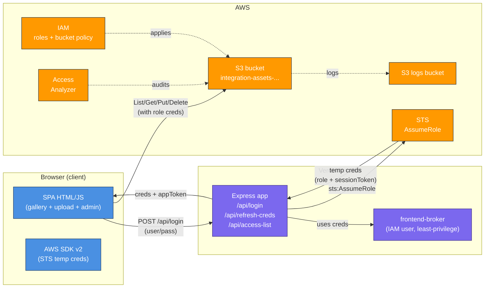
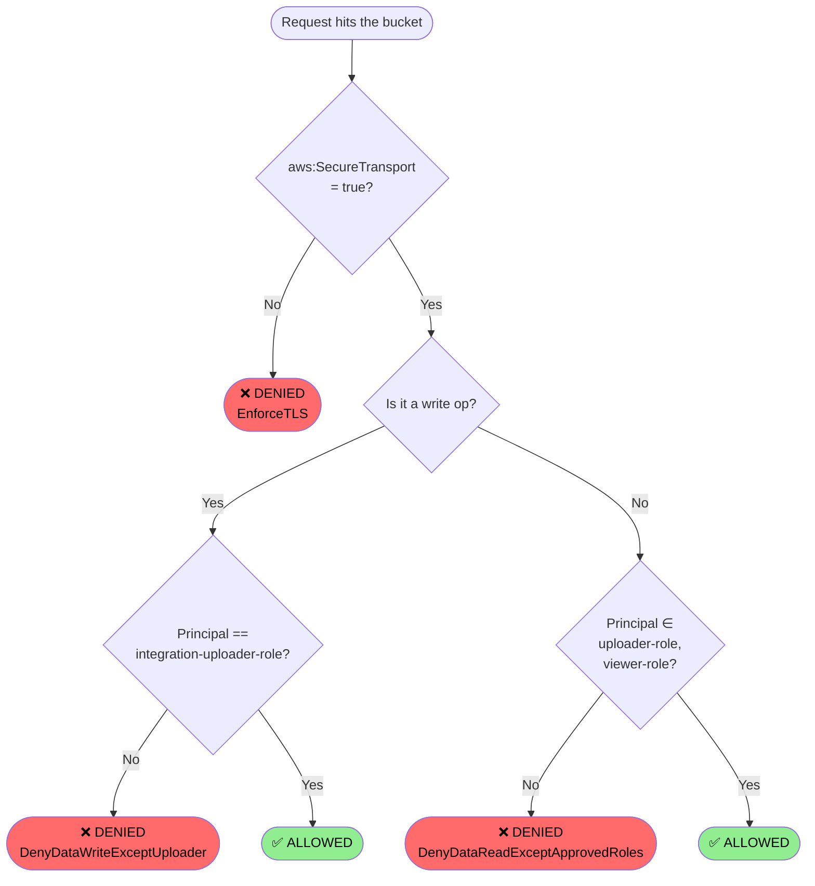
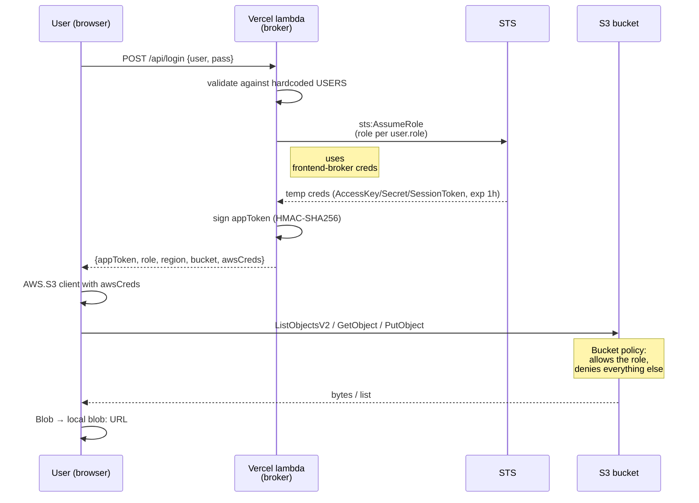
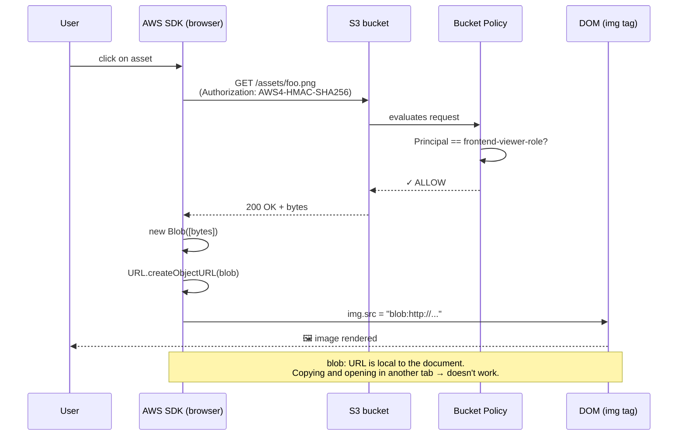
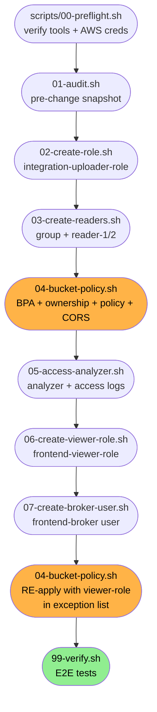

# S3 Restricted Bucket Integration

> 🇪🇸 [Versión en español](README_ES.md)

End-to-end integration of an S3 bucket with restricted access: a service that uploads data and a specific set of users with read access. Frontend (Express + AWS SDK in the browser), bucket hardening via bucket policy, and a broker pattern with STS that issues per-user temporary credentials.

**Live demo:** https://s3-crud-verato-test1.jorgetrad.com

**GitHub repository:** https://github.com/jorgetrad99/s3-crud-verato-test1

---

## The app in action

> Screenshots taken from the version deployed on Vercel.

### 1. Login

Same form for both profiles. The app authenticates against hardcoded users (`admin`/`viewer`) and, on success, calls STS to mint temporary credentials for the corresponding role.


### 2. Viewer — read-only

`viewer` only sees the paginated gallery. No upload zone, no delete buttons, no admin panel. Their temporary credentials correspond to `frontend-viewer-role`, which only has `s3:GetObject` and `s3:ListBucket`.


### 3. Admin — full view

When `admin` logs in, three sections appear:
- Upload zone (drag-and-drop)
- "Who has access to the bucket" table (reads the bucket policy live via `/api/access-list`)
- Gallery with delete button on each row


### 4. Access panel (admin)

The table shows exactly the 2 principals authorized by the bucket policy for data, plus informational cards with the state of Block Public Access, TLS, CORS and the legacy IAM group.


### 5. Drag-and-drop with chip preview

Selected files appear as chips with size and a remove button. The `X / 50` counter shows the bucket capacity in real time.


### 6. The security test: presigned URL signed by `admin-cli` → 403

The test demonstrates that the bucket policy is evaluated **on every request**, not just at signing time. `admin-cli` can technically generate a signed URL (signing is a local computation, no S3 call needed), but when used, S3 verifies the `aws:PrincipalArn` and applies the `Deny`.

> Note: the "click Open in the S3 console" path doesn't work either, because after the final policy `admin-cli` can't even list or open the bucket from the web console. The test goes through the **CLI**.

**Step by step:**

```bash
# 1. Get the key of an object already in the bucket.
#    Possible paths:
#    - Login as admin in the app, click any asset → copy the "Key" field from the modal
#    - Or browse to https://s3-crud-verato-test1.jorgetrad.com → DevTools → Network → request to S3
KEY="assets/Improvising_101.pdf"   # example

# 2. Generate the presigned URL with your admin-cli credentials (default profile).
#    `aws s3 presign` only signs locally, doesn't call S3, so it works
#    even though admin-cli is denied by bucket policy.
URL=$(aws s3 presign "s3://integration-assets-242032648320/${KEY}" --expires-in 300)
echo "$URL"
# Output: https://integration-assets-242032648320.s3.us-east-1.amazonaws.com/assets/...
#   ?X-Amz-Algorithm=AWS4-HMAC-SHA256
#   &X-Amz-Credential=AKIATQWSFECA.../20260507/us-east-1/s3/aws4_request
#   &X-Amz-Signature=...

# 3. Validate from the terminal that the just-signed URL DOES fail
curl -i "$URL" | head -20
# Expected response:
#   HTTP/1.1 403 Forbidden
#   <Error>
#     <Code>AccessDenied</Code>
#     <Message>User: arn:aws:iam::242032648320:user/admin-cli is not
#       authorized to perform: s3:GetObject on resource ... with an
#       explicit deny in a resource-based policy</Message>
#   </Error>
```

**4.** Copy that complete URL (from step 2) and paste it into an **Incognito / InPrivate** browser tab.

**5.** The browser shows S3's XML error with `<Code>AccessDenied</Code>`. Capture that tab — that's the screenshot proving the URL doesn't work even within its 5-minute TTL.


> **What this proves:** even with a cryptographically valid signature and the URL within its TTL, the bucket policy is applied per request. Any identity **outside the 2 roles** (`integration-uploader-role` and `frontend-viewer-role`) gets a 403 — regardless of who shares the URL or which device they use.

> **Counter-test (optional, demonstrates that the role DOES work):** assume `frontend-viewer-role`, generate the URL with those temp creds, paste in incognito → **200 OK** (the role is authorized). Useful to show that the control is identity-based, not path-based:
> ```bash
> CREDS=$(aws sts assume-role \
>   --role-arn arn:aws:iam::242032648320:role/frontend-viewer-role \
>   --role-session-name proof \
>   --external-id integration-upload-2025)
>
> export AWS_ACCESS_KEY_ID=$(echo "$CREDS" | python -c "import json,sys;print(json.load(sys.stdin)['Credentials']['AccessKeyId'])")
> export AWS_SECRET_ACCESS_KEY=$(echo "$CREDS" | python -c "import json,sys;print(json.load(sys.stdin)['Credentials']['SecretAccessKey'])")
> export AWS_SESSION_TOKEN=$(echo "$CREDS" | python -c "import json,sys;print(json.load(sys.stdin)['Credentials']['SessionToken'])")
>
> aws s3 presign "s3://integration-assets-242032648320/${KEY}" --expires-in 300
> # That URL DOES work in incognito for 300s.
>
> # Clean up the temp creds from the shell:
> unset AWS_ACCESS_KEY_ID AWS_SECRET_ACCESS_KEY AWS_SESSION_TOKEN
> ```

---

## Tech stack

| Layer | Technology |
|---|---|
| **Frontend** | Vanilla HTML/CSS/JS · AWS SDK for JavaScript **v2** (loaded from CDN, runs in browser) · native `<dialog>` · drag-drop API · `Blob` + `URL.createObjectURL` for local preview |
| **Backend (Express)** | Node.js 20 (ESM) · Express 4 · `@aws-sdk/client-sts` (AssumeRole) · `@aws-sdk/client-iam` + `@aws-sdk/client-s3` (metadata for the admin panel) · `@aws-sdk/credential-providers` (`fromIni` for local dev) · HMAC-SHA256 (`node:crypto`) for the session token · `dotenv` |
| **AWS** | S3 (bucket + lifecycle + CORS + access logging) · IAM (roles, users, groups, inline policies) · STS (AssumeRole + GetCallerIdentity) · IAM Access Analyzer · CloudTrail (optional for data events) |
| **Provisioning** | AWS CLI v2 · idempotent bash scripts under `scripts/` · `cygpath` for Git Bash compatibility on Windows · `python -m json.tool` for validation |
| **Deploy** | Vercel (function + static via `vercel.json` rewrites) · custom domain |
| **Dev tooling** | Git Bash (MINGW64) · Vercel CLI · GitHub |

---

## Architecture overview




---

## The challenge

From the original prompt:

> You are performing an integration with a service that will be loading data into an AWS bucket. You are being requested to restrict the access to this bucket to only allow for the integration to input data into the bucket and for only an specific set of users to be able to access said data.
>
> - Provide a list of who and what currently has access to the bucket.
> - Make so that only the integration can add/edit files from the bucket.
> - Limit the read access so that only an specific set of users can access the bucket's information.

---

## Architecture decision

Three options considered:

| Option | Pros | Cons | Verdict |
|---|---|---|---|
| **App proxy (Express with bucket creds)** | Simple; URLs never leave the server | Access control lives in the app, not in AWS; AWS only sees "one identity" | ❌ Rejected for not meeting the spirit of the challenge (AWS-native) |
| **STS broker pattern: each user assumes a different IAM role** | AWS does the real access control via bucket policy + IAM; each user has its own identity; per-session traceability | Temp creds briefly live in the browser | ✅ **Chosen** |
| **CloudFront + signed cookies** | Blocks even URL sharing (HttpOnly + SameSite cookie) | Substantially more complex setup (distribution, OAC, key pair, domain) | ⏭️ Mentioned as a possible evolution |

With the chosen option, **the bucket policy is the only real enforcement**; the app is just a broker between `username/password` (hardcoded for the demo) and `sts:AssumeRole`.

---

## Final permission model

### Who has access

| Principal | Type | Read | Write | Purpose |
|---|---|:--:|:--:|---|
| `integration-uploader-role` | role | ✓ | ✓ | Assumed by admin login (uploads/deletes) |
| `frontend-viewer-role` | role | ✓ | — | Assumed by viewer login (read-only) |
| `frontend-broker` | user (least-privilege) | — | — | Only `sts:AssumeRole` over the 2 roles + read metadata for the admin panel |
| `admin-cli` | user (operator) | — | — | Keeps bucket management (`PutBucketPolicy`, etc.) but **denied** at the data level by the bucket policy |
| `reader-1`, `reader-2` | users (legacy) | — | — | Bucket policy explicitly **denies** them — proves that deny wins over any IAM allow |
| Account `root` | n/a | — | — | Also denied at the data level; keeps an escape hatch via policy modification |

> **Key point:** no human has access to the data. Only the 2 roles assumed by the broker can read/write. A presigned URL signed by `admin-cli` or `root` returns **403** because the bucket policy is evaluated on every request.

### Bucket policy (summary)

Three statements:

1. **`DenyDataReadExceptApprovedRoles`** — denies `s3:GetObject`, `s3:GetObjectAttributes`, `s3:GetObjectAcl`, `s3:GetObjectVersion`, `s3:ListBucket`, etc. for any principal that's not one of the 2 roles.
2. **`DenyDataWriteExceptUploader`** — denies `s3:PutObject`, `s3:DeleteObject`, `s3:PutObjectAcl` for any principal other than `integration-uploader-role`.
3. **`EnforceTLS`** — denies `s3:*` if `aws:SecureTransport` is false (HTTPS only).

Full JSON: [`audit-evidence/bucket-policy-applied.json`](audit-evidence/bucket-policy-applied.json) (regenerated on each `bash scripts/04-bucket-policy.sh`).

### How S3 evaluates each request




**Key point:** a `Deny` in a bucket policy **always wins** over any `Allow` in an IAM policy. That's why `reader-1` and `reader-2`, despite their group's IAM policy granting `s3:GetObject`, are denied at the bucket level.

### Defense-in-depth applied

- **Block Public Access:** all 4 options ON
- **Object Ownership:** `BucketOwnerEnforced` (ACLs disabled)
- **Server access logging** → separate bucket `<bucket>-access-logs`
- **IAM Access Analyzer** enabled at account level
- **Bucket CORS** restricted to frontend origins
- **Trust policy** on the roles with `ExternalId` to prevent confused-deputy

---

## Issues encountered (and how they were solved)

### 1. Leakable presigned URLs

The first approach generated server-side signed URLs and passed them to the ``. It works, but **anyone with that URL can access the object for 5 minutes**, no session needed, from any device.

**Solution:** drop presigned URLs entirely. The browser fetches bytes via the SDK with temp creds, converts them to a `Blob`, and renders via local `blob:` URL (not shareable).

### 2. AWS Console allowed opening objects via "Open"

When you click "Open" on an object in the AWS Console, it generates a presigned URL using the current user's session (`admin-cli` in our case). That URL is shareable for its TTL. The original bucket policy had `admin-cli` in the exception list, so the leak existed even though the frontend didn't expose it.

**Solution:** the bucket policy no longer has `admin-cli`/`root`/`reader-1`/`reader-2` in the data-access exception list. **Only the 2 roles can do `s3:GetObject`.** A presigned URL signed by admin-cli now returns 403 even with a valid signature — the bucket policy is evaluated on every request.

### 3. Management operations without breaking ergonomics

If we deny `s3:*` to admin-cli, it also loses `PutBucketPolicy`/`GetBucketPolicy`/`GetPublicAccessBlock` and the maintenance scripts stop working.

**Solution:** the bucket policy `Deny` lists **specific data actions** (`s3:GetObject`, `s3:ListBucket`, `s3:PutObject`, etc.) instead of `s3:*`. Management operations aren't in the deny, so admin-cli remains the operator.

### 4. Broker on serverless

The backend (Express) on Vercel can't read `~/.aws/credentials`. It needs creds injected via env vars. Using admin-cli's permanent keys would be excessive (they have `s3:*` and more).

**Solution:** an IAM user **`frontend-broker`** with a minimal policy:
- `sts:AssumeRole` only on the 2 roles
- `s3:GetBucketPolicy`/`GetBucketCors`/`GetBucketPublicAccessBlock` (for the admin panel)
- `iam:GetGroup`/`GetRole` (for the admin panel)

Its keys go into Vercel as `ADMIN_AWS_ACCESS_KEY_ID/SECRET`. If they leak, the blast radius is very limited.

---

## How the app connects with AWS




- The **appToken** (stateless HMAC, 8h) is only used for `/api/access-list` (admin view) and `/api/refresh-creds`.
- The **AWS temp creds** are used directly browser ↔ S3 via the AWS SDK.
- 2 minutes before expiration, the client calls `POST /api/refresh-creds` to renew without a re-login.

### Asset rendering flow (no presigned URL)




**Why it doesn't leak:** the URL in `` is a local `blob:` from the browser, valid only inside the document that created it. The "real" URL of the object in S3 never appears as a shareable string — it always travels in the `Authorization` header of the original request.

---

## AWS resources deployed

| Resource | Name | Created by |
|---|---|---|
| S3 bucket | `integration-assets-242032648320` | `scripts/04-bucket-policy.sh` |
| Logs bucket | `integration-assets-242032648320-access-logs` | `scripts/05-access-analyzer.sh` |
| IAM role (uploader) | `integration-uploader-role` | `scripts/02-create-role.sh` |
| IAM role (viewer) | `frontend-viewer-role` | `scripts/06-create-viewer-role.sh` |
| IAM user (broker) | `frontend-broker` | `scripts/07-create-broker-user.sh` |
| IAM users (legacy demo) | `reader-1`, `reader-2` | `scripts/03-create-readers.sh` |
| IAM group | `s3-readers` | `scripts/03-create-readers.sh` |
| Access Analyzer | `account-bucket-analyzer` | `scripts/05-access-analyzer.sh` |

---

## Commands used (CLI)

All scripts are **idempotent**: re-running them won't break anything, they skip what already exists, and reapply what's configurable.

### Execution order




> ⚠️ **Point of no return:** the second run of script `04` (after Phase 6) applies the definitive `Deny`. From that moment on, only the 2 roles can touch data. Make sure the broker is created (Phase 7) before that if you'll use the app from Vercel.

```bash
# Variables resolved dynamically from STS GetCallerIdentity
source .envrc

# Phase 1 — Snapshot of the current bucket / IAM state (before changes)
bash scripts/01-audit.sh
# Output: audit-evidence/{bucket-policy-before.json, iam-users.txt, iam-roles.txt, ...}

# Phase 2 — Role for uploads (assumed by the admin login)
bash scripts/02-create-role.sh
# Creates: integration-uploader-role
# Inline policy: s3:PutObject, DeleteObject, GetObject, ListBucket on the bucket
# Trust policy: AccountRoot + StringEquals sts:ExternalId condition

# Phase 3 — Legacy IAM users + group (defense-in-depth demo)
bash scripts/03-create-readers.sh
# Creates: s3-readers group, reader-1, reader-2
# Group inline policy: s3:GetObject, ListBucket
# (These users will be DENIED by the bucket policy in Phase 4 — defense-in-depth)

# Phase 4 — Bucket hardening
bash scripts/04-bucket-policy.sh
# - Block Public Access ON (all 4 options)
# - Object Ownership: BucketOwnerEnforced
# - Bucket policy: 3 statements (DenyDataReadExceptApprovedRoles, DenyDataWriteExceptUploader, EnforceTLS)
# - CORS: only $FRONTEND_ORIGINS

# Phase 5 — Audit + logging
bash scripts/05-access-analyzer.sh
# - IAM Access Analyzer (Account-level)
# - Access logs bucket + server access logging enabled

# Phase 6 — Read-only role (assumed by the viewer login)
bash scripts/06-create-viewer-role.sh
# Creates: frontend-viewer-role
# Inline policy: s3:GetObject, ListBucket (NO write)

# Phase 7 — Broker user for Vercel (least-privilege)
bash scripts/07-create-broker-user.sh
# Creates: frontend-broker
# Inline policy: sts:AssumeRole on the 2 roles + iam:GetGroup/GetRole + s3:GetBucket{Policy,Cors,PublicAccessBlock}
# Generates access keys → audit-evidence/frontend-broker-keys.json (chmod 600)
```

### Reading live state

```bash
# Show current bucket policy
aws s3api get-bucket-policy --bucket $BUCKET --query Policy --output text | python -m json.tool

# Show Block Public Access state
aws s3api get-public-access-block --bucket $BUCKET

# Show CORS
aws s3api get-bucket-cors --bucket $BUCKET

# Confirm admin-cli is denied for data
aws s3 ls s3://$BUCKET/   # → AccessDenied

# Confirm the assumed role CAN read
aws sts assume-role --role-arn arn:aws:iam::$ACCOUNT_ID:role/$VIEWER_ROLE_NAME \
  --role-session-name test --external-id $EXTERNAL_ID
# (then export AWS_ACCESS_KEY_ID, SECRET, SESSION_TOKEN and aws s3 ls $BUCKET → OK)
```

---

## How to do it from the AWS Console (UI)

Equivalent steps to do each thing through the web console.

### Phase 1 — Audit the current bucket state

1. **S3** → select the bucket → **Permissions** tab
2. Capture the **Bucket policy** JSON (may be empty)
3. Review **Block public access**, **Access Control List**, **Object Ownership**
4. **IAM** → **Users** and **Roles** → export lists

> 📸 _Screenshot: bucket Permissions tab_  
> 

> 📸 _Screenshot: bucket policy JSON_  
> 

> 📸 _Screenshot: IAM users / roles list_  
> 
> 

---

### Phase 2 — Create the uploader role (`integration-uploader-role`)

1. **IAM** → **Roles** → **Create role**
2. *Trusted entity type:* **AWS account** → **This account**
3. Tick **Require external ID** and enter `integration-upload-2025`
4. **Next** → skip attach permissions (we'll do it inline)
5. *Role name:* `integration-uploader-role` → **Create role**
6. Open the role → **Permissions** → **Add permissions** → **Create inline policy**
7. **JSON** tab → paste the contents of `scripts/02-create-role.sh` (permission policy section)
8. *Name:* `S3UploadPolicy` → **Create policy**

---

### Phase 3 — Create the `s3-readers` group + `reader-1`, `reader-2` users

1. **IAM** → **User groups** → **Create group** → name `s3-readers`
2. Skip attach permissions; **Create group**
3. Open the group → **Permissions** → **Add permissions** → **Create inline policy** → JSON with `s3:GetObject` + `s3:ListBucket` over the bucket → name `S3ReadOnlyAccess`
4. **IAM** → **Users** → **Create user**
5. Username: `reader-1` → **Add user to group** → tick `s3-readers` → **Create user**
6. Open `reader-1` → **Security credentials** → **Create access key** → *Application running outside AWS* → save the .csv
7. Repeat for `reader-2`

> 📸 _Screenshot: group with inline policy_  
> 

> 📸 _Screenshot: user in the group_  
> 

---

### Phase 4 — Bucket hardening

1. **S3** → bucket → **Permissions** → **Block public access (bucket settings)** → **Edit** → tick all 4 → **Save**
2. **Object Ownership** → **Edit** → select **ACLs disabled (recommended)** → **Save**
3. **Bucket policy** → **Edit** → paste the JSON with the 3 statements (substituting your Account ID and bucket) → **Save changes**
4. **CORS configuration** → **Edit** → paste the `CORSRules` array with your origins → **Save changes**

> 📸 _Screenshot: Block Public Access ON_  
> 

> 📸 _Screenshot: bucket policy JSON applied_  
> 

> 📸 _Screenshot: CORS rules_  
> 

---

### Phase 5 — Access Analyzer + server access logging

1. **IAM** → **Access Analyzer** → **Analyzers** → **Create analyzer**
2. *Type:* **Account analyzer** → name `account-bucket-analyzer` → **Create**
3. **S3** → create the logs bucket `<bucket>-access-logs` (Block Public Access ON from the start)
4. Go to the original bucket → **Properties** → **Server access logging** → **Edit** → **Enable** → target `<bucket>-access-logs/logs/` → **Save**

> 📸 _Screenshot: Access Analyzer findings_  
> 

> 📸 _Screenshot: server access logging enabled_  
> 

---

### Phase 6 — Create the viewer role (`frontend-viewer-role`)

Same steps as Phase 2, but:
- *Role name:* `frontend-viewer-role`
- Inline policy with ONLY `s3:GetObject`, `s3:GetObjectAttributes`, `s3:ListBucket`, `s3:GetBucketLocation` (no write)
- *Description:* `Frontend viewer (read-only) role assumed via STS`

> 📸 _Screenshot: viewer role summary_  
> 

---

### Phase 7 — Create the broker user (`frontend-broker`)

1. **IAM** → **Users** → **Create user** → name `frontend-broker`
2. **Do NOT** add to any group; skip attach policies
3. Open the user → **Permissions** → **Add permissions** → **Create inline policy** → JSON with `sts:AssumeRole` on the 2 role ARNs + the 3 s3:GetBucket* + iam:GetGroup/GetRole → name `FrontendBrokerPolicy`
4. **Security credentials** → **Create access key** → *Application running outside AWS* → save the `.csv` (you'll need it for Vercel)

> 📸 _Screenshot: broker user inline policy_  
> 

---

## How to run the app

### Local

```bash
# 1. Install server deps
cd frontend-app/server
npm install

# 2. Server .env (copy from .env.example, fill in)
cp .env.example .env
# Edit BUCKET_NAME, ROLE_ARN, VIEWER_ROLE_ARN, TOKEN_SECRET, AWS_ADMIN_PROFILE

# 3. Start
npm start
# → http://localhost:3001
```

Login:
- `admin` / `admin1234` → assumes `integration-uploader-role` (read+write)
- `viewer` / `viewer1234` → assumes `frontend-viewer-role` (read-only)

### Vercel

Already deployed at https://s3-crud-verato-test1.jorgetrad.com (alias of project `s3-crud-verato`).

One-time setup steps:

```bash
cd frontend-app
vercel link --project s3-crud-verato

# Push the 11 env vars from audit-evidence/vercel.env
while IFS='=' read -r key value; do
  [ -z "$key" ] && continue
  printf '%s' "$value" | vercel env add "$key" production --force
done < ../audit-evidence/vercel.env

vercel deploy --prod
```

After the first deploy, add the Vercel domain to `FRONTEND_ORIGINS` in `.envrc` and re-run `bash scripts/04-bucket-policy.sh` to update bucket CORS.

---

## Verification

```bash
bash scripts/99-verify.sh
```

Automated tests (all should PASS):
- Reader can list
- Reader **cannot** upload
- Plain HTTP connection rejected (TLS condition)
- Role can upload via AssumeRole
- Block Public Access ON
- Bucket policy present
- Access Analyzer exists

Recommended manual tests from the browser:
1. Login `viewer` → gallery loads
2. Logout, login `admin` → "Who has access to the bucket" + upload zone visible
3. **Paste a console "Open" URL of an object into an incognito tab** → must return **403** (admin-cli denied)
4. DevTools Network → confirm S3 requests don't have `X-Amz-Signature` in the URL (only in the Authorization header)

---

## Cleanup

```bash
bash scripts/cleanup.sh
# Asks you to type literal "DELETE" to confirm
# Wipes: bucket + contents, logs bucket, IAM users, group, roles, analyzer
```

---

## Repo structure

```
.
├── README.md                              # this file (English)
├── README_ES.md                           # Spanish version
├── .envrc                                 # variables resolved dynamically
├── scripts/
│   ├── lib.sh                             # shared helpers
│   ├── 00-preflight.sh                    # check tools + AWS auth
│   ├── 01-audit.sh                        # pre-change snapshots
│   ├── 02-create-role.sh                  # uploader role
│   ├── 03-create-readers.sh               # legacy IAM users + group
│   ├── 04-bucket-policy.sh                # hardening + CORS
│   ├── 05-access-analyzer.sh              # analyzer + logging
│   ├── 06-create-viewer-role.sh           # viewer role
│   ├── 07-create-broker-user.sh           # broker user for Vercel
│   ├── 99-verify.sh                       # E2E tests
│   └── cleanup.sh                         # tear-down
├── frontend-app/
│   ├── api/index.js                       # Vercel function entry
│   ├── server/
│   │   ├── index.js                       # Express app: login + AssumeRole + access-list
│   │   ├── package.json
│   │   └── .env.example
│   ├── client/
│   │   ├── index.html                     # SPA: login, gallery, upload, access-list
│   │   ├── app.js                         # AWS SDK v2 → S3 directly from browser
│   │   └── style.css
│   ├── package.json                       # deps for the Vercel function
│   └── vercel.json                        # rewrites
└── audit-evidence/                        # gitignored — snapshots + access keys + logs
```
