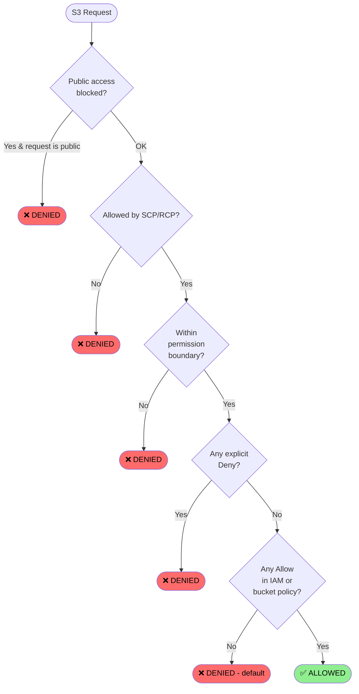

# AWS S3 — Bucket Permission Options

A reference guide to every permission and access-control mechanism that AWS exposes for Amazon S3 buckets and objects.

Each section explains what the mechanism does, when to use it, and **how to apply it both from the AWS CLI and from the AWS Console (UI)**.

---

## Table of contents

1. [How S3 evaluates a request](#how-s3-evaluates-a-request)
2. [Identity-based policies (IAM)](#1-identity-based-policies-iam)
3. [Resource-based policies — the bucket policy](#2-resource-based-policies--the-bucket-policy)
4. [Access Control Lists (ACLs)](#3-access-control-lists-acls)
5. [Object Ownership](#4-object-ownership)
6. [Block Public Access (BPA)](#5-block-public-access-bpa)
7. [S3 Access Points](#6-s3-access-points)
8. [S3 Object Lambda Access Points](#7-s3-object-lambda-access-points)
9. [S3 Access Grants](#8-s3-access-grants)
10. [STS — temporary credentials](#9-sts--temporary-credentials)
11. [Presigned URLs](#10-presigned-urls)
12. [Pre-signed POST policies](#11-pre-signed-post-policies)
13. [CORS](#12-cors)
14. [Cross-account access](#13-cross-account-access)
15. [VPC endpoints for S3](#14-vpc-endpoints-for-s3)
16. [Encryption-related access controls](#15-encryption-related-access-controls)
17. [TLS-only enforcement](#16-tls-only-enforcement)
18. [Object Lock (WORM)](#17-object-lock-worm)
19. [MFA Delete](#18-mfa-delete)
20. [Versioning and per-version permissions](#19-versioning-and-per-version-permissions)
21. [Access logs and audit trails](#20-access-logs-and-audit-trails)
22. [IAM Access Analyzer](#21-iam-access-analyzer)
23. [Service Control Policies (SCPs)](#22-service-control-policies-scps)
24. [Resource Control Policies (RCPs)](#23-resource-control-policies-rcps)
25. [Tag-based access control (ABAC)](#24-tag-based-access-control-abac)
26. [Account-level Block Public Access](#25-account-level-block-public-access)
27. [CloudFront + Origin Access Control](#26-cloudfront--origin-access-control-oac)
28. [S3 on Outposts and S3 Express One Zone](#27-s3-on-outposts-and-s3-express-one-zone)

---

## How S3 evaluates a request

Every S3 request is evaluated against a stack of policies. The simplified rule:

1. **Default = Deny.** No policy ⇒ no access.
2. An **Allow** anywhere in the relevant policies grants access — *unless* an **explicit Deny** wins.
3. **Explicit Deny always wins**, in any policy (IAM, bucket policy, SCP, session policy, endpoint policy, KMS key policy).
4. The first guardrail that runs is **Block Public Access** — if the request would make the bucket public, it is denied before policy evaluation.
5. **SCPs and RCPs** (organization level) cap maximum permissions, even for root.
6. **Permission boundaries** further cap an identity's permissions.
7. **Session policies** further cap a session created via `AssumeRole`.



---

## 1. Identity-based policies (IAM)

JSON documents attached to **users**, **groups**, or **roles** that grant permissions to AWS resources.

| Sub-type | Description |
|---|---|
| **AWS managed** | Predefined policies maintained by AWS (`AmazonS3ReadOnlyAccess`, `AmazonS3FullAccess`, `AmazonS3ObjectLambdaExecutionRolePolicy`, …) |
| **Customer managed** | Reusable policies you write and version, attachable to many identities |
| **Inline** | Embedded directly in a user/group/role; lifecycle tied to the principal |
| **Permission boundaries** | Maximum-permissions cap on what an identity-based policy can grant |
| **Session policies** | Passed at `AssumeRole` time to further restrict the resulting session |

**Via CLI:**

```bash
# Attach an AWS managed policy
aws iam attach-user-policy --user-name $USER \
  --policy-arn arn:aws:iam::aws:policy/AmazonS3ReadOnlyAccess

# Embed an inline policy
aws iam put-user-policy --user-name $USER \
  --policy-name InlineS3Read --policy-document file://policy.json

# Set a permission boundary
aws iam put-user-permissions-boundary --user-name $USER \
  --permissions-boundary arn:aws:iam::aws:policy/PowerUserAccess
```

**Via AWS Console:**

1. Open **IAM** → **Users / User groups / Roles** → select the principal.
2. **Permissions** tab → **Add permissions** → choose:
   - **Attach policies directly** → search and check an AWS managed or customer managed policy → **Next** → **Add permissions**.
   - **Create inline policy** → tab **JSON** → paste the policy → **Next** → name it → **Create policy**.
3. To set a permission boundary: open the user/role → **Permissions** tab → **Permissions boundary** card → **Set permissions boundary** → pick a managed policy → **Set boundary**.

> 📸 _IAM → Users list_
> 
>
> 📸 _IAM → Roles list_
> 

---

## 2. Resource-based policies — the bucket policy

A JSON document attached to the bucket itself. Statements have `Effect`, `Principal`, `Action`, `Resource`, and optional `Condition`.

```json
{
  "Version": "2012-10-17",
  "Statement": [
    {
      "Sid": "AllowReadFromOneRole",
      "Effect": "Allow",
      "Principal": { "AWS": "arn:aws:iam::111122223333:role/reader-role" },
      "Action": ["s3:GetObject", "s3:ListBucket"],
      "Resource": [
        "arn:aws:s3:::my-bucket",
        "arn:aws:s3:::my-bucket/*"
      ]
    },
    {
      "Sid": "ForceTLS",
      "Effect": "Deny",
      "Principal": "*",
      "Action": "s3:*",
      "Resource": ["arn:aws:s3:::my-bucket", "arn:aws:s3:::my-bucket/*"],
      "Condition": { "Bool": { "aws:SecureTransport": "false" } }
    }
  ]
}
```

### Common condition keys for S3

| Condition key | Use |
|---|---|
| `aws:PrincipalArn`, `aws:PrincipalOrgID`, `aws:PrincipalTag/<k>` | Filter by caller identity |
| `aws:SourceIp`, `aws:VpcSourceIp` | Restrict by network origin |
| `aws:SourceVpc`, `aws:SourceVpce` | Force traffic via a VPC endpoint |
| `aws:SecureTransport` | Force HTTPS |
| `aws:MultiFactorAuthPresent`, `aws:MultiFactorAuthAge` | Require MFA |
| `aws:RequestedRegion` | Restrict by region |
| `s3:x-amz-server-side-encryption` | Require encryption at upload |
| `s3:x-amz-server-side-encryption-aws-kms-key-id` | Require a specific KMS key |
| `s3:x-amz-acl`, `s3:x-amz-grant-*` | Restrict ACLs (legacy) |
| `s3:RequestObjectTag/<k>`, `s3:ExistingObjectTag/<k>` | Tag-based access (ABAC) |
| `s3:authType`, `s3:signatureversion`, `s3:signatureAge` | Restrict signing details |
| `s3:object-lock-mode`, `s3:object-lock-retain-until-date` | WORM enforcement |

> **Explicit `Deny` always wins** over any `Allow`, in IAM or in the bucket policy.

**Via CLI:**

```bash
aws s3api put-bucket-policy --bucket $BUCKET --policy file://bucket-policy.json
aws s3api get-bucket-policy --bucket $BUCKET --query Policy --output text | python -m json.tool
aws s3api delete-bucket-policy --bucket $BUCKET
```

**Via AWS Console:**

1. **S3** → click the bucket → tab **Permissions**.
2. Card **Bucket policy** → **Edit**.
3. Paste the JSON in the editor (the **Policy generator** link opens an assisted form).
4. **Save changes**. AWS validates the JSON; errors highlight the offending line.
5. Use the **Policy examples** link for AWS-curated patterns (cross-account, force TLS, force encryption).

> 📸 _Bucket → Permissions tab landing page_
> 
>
> 📸 _Bucket policy editor with a JSON document applied_
> 

---

## 3. Access Control Lists (ACLs)

The original S3 permission model — per-bucket and per-object grants. Considered legacy; AWS recommends disabling ACLs and using policies instead.

### Canned ACLs

| Canned ACL | Effect |
|---|---|
| `private` | Only owner |
| `public-read` | Public read |
| `public-read-write` | Public read/write (avoid) |
| `authenticated-read` | Any AWS-authenticated user |
| `aws-exec-read` | EC2 read of AMIs |
| `bucket-owner-read` | Bucket owner can read object |
| `bucket-owner-full-control` | Bucket owner full control of object |
| `log-delivery-write` | Allows the log-delivery group to write |

### Fine-grained grant types

`READ`, `WRITE`, `READ_ACP`, `WRITE_ACP`, `FULL_CONTROL`.

### Predefined groups

`AuthenticatedUsers`, `AllUsers` (anonymous), `LogDelivery`.

> **Modern guidance: disable ACLs.** Set Object Ownership to `BucketOwnerEnforced`. Buckets created in the AWS Console default to ACLs disabled since April 2023.

**Via CLI:**

```bash
# Read bucket ACL
aws s3api get-bucket-acl --bucket $BUCKET

# Apply a canned ACL to an object
aws s3api put-object-acl --bucket $BUCKET --key file.txt --acl bucket-owner-full-control

# Apply a canned ACL to the bucket (only when ACLs are not disabled)
aws s3api put-bucket-acl --bucket $BUCKET --acl private
```

**Via AWS Console:**

1. **S3** → bucket → tab **Permissions** → card **Access control list (ACL)** → **Edit**.
2. If the card says *ACLs disabled*, you must first switch Object Ownership (next section) before any ACL change is allowed.
3. Otherwise, check/uncheck **Read / Write / Read ACL / Write ACL** for **Bucket owner**, **Everyone (public access)**, **Authenticated users**, or **S3 log delivery group**.
4. **Save changes**. The console warns if changes would expose the bucket publicly.
5. To set an ACL on a single object: **Objects** tab → click an object → tab **Permissions** → **Edit**.

---

## 4. Object Ownership

Controls who owns objects uploaded by other accounts and whether ACLs are usable at all.

| Setting | Behavior |
|---|---|
| `BucketOwnerEnforced` | **ACLs disabled.** Bucket owner owns every object. Recommended. |
| `BucketOwnerPreferred` | ACLs enabled; uploads with `bucket-owner-full-control` give ownership to bucket owner |
| `ObjectWriter` | ACLs enabled; uploader keeps ownership |

**Via CLI:**

```bash
aws s3api put-bucket-ownership-controls --bucket $BUCKET \
  --ownership-controls 'Rules=[{ObjectOwnership=BucketOwnerEnforced}]'

aws s3api get-bucket-ownership-controls --bucket $BUCKET
```

**Via AWS Console:**

1. **S3** → bucket → tab **Permissions** → card **Object Ownership** → **Edit**.
2. Choose one of:
   - **ACLs disabled (recommended)** → option **Bucket owner enforced**.
   - **ACLs enabled** → then pick **Bucket owner preferred** or **Object writer**.
3. **Save changes**. Switching to `BucketOwnerEnforced` clears existing ACLs; the console warns and requires confirmation.

---

## 5. Block Public Access (BPA)

A guardrail that overrides any ACL or bucket policy that would expose the bucket publicly.

| Flag | What it blocks |
|---|---|
| `BlockPublicAcls` | Setting new public ACLs |
| `IgnorePublicAcls` | Honoring any existing public ACL |
| `BlockPublicPolicy` | Saving new public bucket policies |
| `RestrictPublicBuckets` | Cross-account/anonymous access via existing public bucket policies |

Available at **bucket level** and **account level** — account level wins.

**Via CLI:**

```bash
aws s3api put-public-access-block --bucket $BUCKET \
  --public-access-block-configuration \
  "BlockPublicAcls=true,IgnorePublicAcls=true,BlockPublicPolicy=true,RestrictPublicBuckets=true"

aws s3api get-public-access-block --bucket $BUCKET
```

**Via AWS Console:**

1. **S3** → bucket → tab **Permissions** → card **Block public access (bucket settings)** → **Edit**.
2. Check **Block all public access** (selects all four sub-options) or check the four sub-options individually.
3. **Save changes** → type the literal `confirm` when prompted.

> 📸 _Block Public Access dialog with all four flags ON_
> 

---

## 6. S3 Access Points

Named network endpoints, each with its own access policy and (optionally) VPC restriction.

| Variant | Use case |
|---|---|
| **Standard access point** | Per-application policy on top of one bucket |
| **VPC-restricted access point** | Limit access-point traffic to one VPC |
| **Multi-Region Access Points (MRAP)** | Single global endpoint that routes to the closest replicated bucket |

**Via CLI:**

```bash
aws s3control create-access-point --account-id $ACCOUNT \
  --name app-a-ap --bucket $BUCKET \
  --vpc-configuration VpcId=vpc-12345678

aws s3control put-access-point-policy --account-id $ACCOUNT \
  --name app-a-ap --policy file://ap-policy.json
```

**Via AWS Console:**

1. **S3** → left nav **Access Points** → **Create access point**.
2. *Access point name*, *Bucket name* → choose **Internet** or **VPC** for *Network origin* (VPC requires a `vpc-id`).
3. Configure **Block Public Access** for this access point (defaults to all blocked).
4. *Access point policy*: paste JSON or use the policy generator → **Create access point**.
5. For **MRAP**: left nav **Multi-Region Access Points** → **Create Multi-Region Access Point** → choose buckets in different regions → routing controls are configured after creation.

---

## 7. S3 Object Lambda Access Points

An access point that invokes a Lambda function to transform / redact / repackage objects before delivery — useful for PII redaction, format conversion, or row-level filtering on shared datasets.

**Via CLI:**

```bash
aws s3control create-access-point-for-object-lambda --account-id $ACCOUNT \
  --name redact-pii --configuration file://olap-config.json
```

**Via AWS Console:**

1. **S3** → left nav **Object Lambda Access Points** → **Create Object Lambda Access Point**.
2. *Object Lambda Access Point name*; *Supporting Access Point* → pick a standard access point that fronts the bucket.
3. *Transformation configuration* → choose the S3 API (`GetObject`, `HeadObject`, `ListObjects`, `ListObjectsV2`) and the Lambda function to invoke.
4. (Optional) Pass *Payload* string to your Lambda for parameterization.
5. **Create Object Lambda Access Point**.

---

## 8. S3 Access Grants

A newer service (2023+) for mapping IAM principals or directory identities (IAM Identity Center, OIDC) to S3 prefixes at scale.

**Via CLI:**

```bash
# 1. One-time per account/region
aws s3control create-access-grants-instance --account-id $ACCOUNT

# 2. Register a location (a bucket or prefix)
aws s3control create-access-grants-location --account-id $ACCOUNT \
  --location-scope s3://$BUCKET/team-a/* --iam-role-arn $ROLE_ARN

# 3. Grant a specific IAM principal access to a sub-prefix
aws s3control create-access-grant --account-id $ACCOUNT \
  --access-grants-location-id $LOC_ID \
  --grantee GranteeType=IAM,GranteeIdentifier=$USER_ARN \
  --permission READ \
  --access-grants-location-configuration S3SubPrefix=team-a/alice/*
```

**Via AWS Console:**

1. **S3** → left nav **Access Grants** → choose region → **Create S3 Access Grants instance** (one-time).
2. (Optional) **Connect IAM Identity Center** to grant to directory users/groups.
3. Tab **Locations** → **Register location** → select bucket / prefix → pick the IAM role S3 will use to access it.
4. Tab **Grants** → **Create grant** → pick the location → set *Sub-prefix* → choose **Grantee** (IAM user/role/group, or Identity Center user/group) → permission `READ` / `WRITE` / `READWRITE` → **Create grant**.

---

## 9. STS — temporary credentials

How non-AWS users (or backends without an identity) get short-lived AWS credentials. The role's **trust policy** decides who can assume it.

| API | Use |
|---|---|
| `sts:AssumeRole` | Cross-account / role-chaining (use `ExternalId` to prevent confused-deputy) |
| `sts:AssumeRoleWithWebIdentity` | OIDC federation (Cognito, Google, GitHub Actions OIDC) |
| `sts:AssumeRoleWithSAML` | SAML federation (corporate IdP) |
| `sts:GetFederationToken` | IAM-user-based federation (legacy) |
| `sts:GetSessionToken` | MFA-required short-lived credentials |

**Via CLI:**

```bash
aws sts assume-role \
  --role-arn arn:aws:iam::111122223333:role/reader-role \
  --role-session-name browser-user-42 \
  --external-id your-external-id \
  --duration-seconds 3600
```

**Via AWS Console:**

The console does not call `AssumeRole` directly with arbitrary parameters, but you create the **role** that will be assumed:

1. **IAM** → **Roles** → **Create role**.
2. *Trusted entity type*:
   - **AWS account** → for cross-account or same-account `AssumeRole` (check **Require external ID** to add an `ExternalId` condition).
   - **Web identity** → for OIDC providers (Cognito, GitHub Actions, etc.).
   - **SAML 2.0 federation** → for corporate IdP.
   - **AWS service** → for an EC2/Lambda/ECS execution role.
3. *Permissions policies* → attach or skip (you can add inline later).
4. *Role name* and *Description* → **Create role**.
5. To switch role in the console: top-right account menu → **Switch role** → enter account, role name, optional display name. The browser session uses the role's credentials.

---

## 10. Presigned URLs

A time-limited HTTPS URL signed with the caller's credentials that grants the URL holder the same permissions on a single object.

- The signature is a **local** computation — `aws s3 presign` does not call S3.
- The bucket policy is **still evaluated on every request** that uses the URL — a presigned URL signed by a denied principal returns 403 even when the signature is valid.
- Default lifetime: up to 7 days for SigV4.

**Via CLI:**

```bash
aws s3 presign s3://$BUCKET/file.pdf --expires-in 300
```

**Via AWS Console:**

1. **S3** → bucket → click an object.
2. **Object actions** → **Share with a presigned URL**.
3. Enter expiry duration (1 minute to 12 hours via the console) → **Create presigned URL**.
4. The URL is copied to your clipboard. The console-generated URL inherits **your console session credentials**.

---

## 11. Pre-signed POST policies

Variant of presigned URLs aimed at HTML form uploads from browsers. The server signs a JSON "policy" of allowed conditions (max size, content-type prefix, key prefix, expiry); the browser then POSTs with that signature.

**Via CLI / SDK:**

```python
import boto3

boto3.client("s3").generate_presigned_post(
    Bucket="my-bucket",
    Key="uploads/${filename}",
    Conditions=[
        ["content-length-range", 0, 10_485_760],
        ["starts-with", "$Content-Type", "image/"],
    ],
    ExpiresIn=600,
)
```

**Via AWS Console:** *No native UI.* Pre-signed POST is generated programmatically from your backend. The Console only offers presigned `GET` URLs (previous section).

---

## 12. CORS

`PutBucketCors` accepts a list of `CORSRule`s controlling which origins/methods/headers the **browser** is allowed to use. Enforced by the browser, not by S3 — not a security boundary.

```json
{
  "CORSRules": [
    {
      "AllowedOrigins": ["https://app.example.com"],
      "AllowedMethods": ["GET", "PUT", "POST", "DELETE"],
      "AllowedHeaders": ["*"],
      "ExposeHeaders": ["ETag"],
      "MaxAgeSeconds": 3000
    }
  ]
}
```

**Via CLI:**

```bash
aws s3api put-bucket-cors --bucket $BUCKET --cors-configuration file://cors.json
aws s3api get-bucket-cors --bucket $BUCKET
aws s3api delete-bucket-cors --bucket $BUCKET
```

**Via AWS Console:**

1. **S3** → bucket → tab **Permissions** → scroll to card **Cross-origin resource sharing (CORS)** → **Edit**.
2. Paste the JSON array of `CORSRules`.
3. **Save changes**. The console validates JSON syntax and required fields.

> 📸 _CORS rules editor_
> 

---

## 13. Cross-account access

To grant another AWS account access:
- A **bucket policy** that names the other account / its role as `Principal`, **plus** an IAM policy in the other account that allows the call.
- Or a role that the other account can `AssumeRole` into.
- Use `aws:SourceAccount` / `aws:SourceArn` conditions to scope service-to-service calls.
- For object ownership across accounts, set `BucketOwnerEnforced`.

**Via CLI:**

```bash
# In the bucket-owner account: bucket policy
aws s3api put-bucket-policy --bucket $BUCKET --policy file://cross-account-policy.json

# In the consumer account: IAM policy that allows s3 calls on the bucket
aws iam put-role-policy --role-name $CONSUMER_ROLE \
  --policy-name CrossAccountS3 --policy-document file://consumer.json
```

**Via AWS Console:**

1. **Bucket-owner account:** **S3** → bucket → **Permissions** → **Bucket policy** → **Edit** → add a statement with `"Principal": { "AWS": "arn:aws:iam::<consumer-account>:root" }` (or a specific role/user ARN).
2. **Consumer account:** **IAM** → user/role → **Permissions** → **Add permissions** → **Create inline policy** → JSON granting the desired S3 actions on the bucket ARN.
3. Optional: **IAM** → **Roles** → **Create role** → trusted entity **AWS account** → enter the consumer account ID, attach a policy, and have the consumer call `AssumeRole`.

---

## 14. VPC endpoints for S3

Keep S3 traffic off the public internet.

| Variant | Notes |
|---|---|
| **Gateway endpoint** | S3-specific, free, route-table based |
| **Interface endpoint (PrivateLink)** | ENI in your VPC, paid, supports cross-region |
| **Endpoint policies** | JSON policy on the VPC endpoint that limits which buckets/actions can be used through it |
| `aws:SourceVpc` / `aws:SourceVpce` | Bucket-policy conditions to force access through a specific VPC or endpoint |

**Via CLI:**

```bash
# Gateway endpoint
aws ec2 create-vpc-endpoint --vpc-id $VPC_ID \
  --service-name com.amazonaws.us-east-1.s3 \
  --route-table-ids $RT_ID --vpc-endpoint-type Gateway \
  --policy-document file://endpoint-policy.json

# Interface endpoint
aws ec2 create-vpc-endpoint --vpc-id $VPC_ID \
  --service-name com.amazonaws.us-east-1.s3 \
  --vpc-endpoint-type Interface \
  --subnet-ids $SUBNET_ID --security-group-ids $SG_ID
```

**Via AWS Console:**

1. **VPC** → left nav **Endpoints** → **Create endpoint**.
2. *Service category* → **AWS services**; *Service name* search `s3` → choose **com.amazonaws.<region>.s3** with type **Gateway** or **Interface**.
3. *VPC* → pick your VPC.
4. **Gateway:** select **Route tables** the endpoint should be added to.
   **Interface:** select **Subnets** and **Security groups**.
5. *Policy* → **Full access** or **Custom** (paste a JSON endpoint policy).
6. **Create endpoint**. After creation, add `aws:SourceVpce = <endpoint-id>` conditions in your bucket policy if you want to *force* traffic through this endpoint.

---

## 15. Encryption-related access controls

| Mode | Notes |
|---|---|
| `SSE-S3` (AES256) | S3-managed keys, default for new buckets |
| `SSE-KMS` | Customer-managed or AWS-managed KMS key; KMS key policy adds another permission layer |
| `DSSE-KMS` (Dual-layer) | Two layers of KMS encryption |
| `SSE-C` | Customer-provided keys passed in headers |
| `S3 Bucket Keys` | Reduces KMS API costs by ~99% on high-throughput SSE-KMS |

Bucket-level: `PutBucketEncryption` plus a bucket policy that forces encryption at upload (`s3:x-amz-server-side-encryption` condition). KMS key policies are an additional gate that bucket policies cannot bypass.

```json
{
  "Rules": [{
    "ApplyServerSideEncryptionByDefault": {
      "SSEAlgorithm": "aws:kms",
      "KMSMasterKeyID": "arn:aws:kms:us-east-1:111122223333:key/abcd-…"
    },
    "BucketKeyEnabled": true
  }]
}
```

**Via CLI:**

```bash
aws s3api put-bucket-encryption --bucket $BUCKET \
  --server-side-encryption-configuration file://sse-config.json
aws s3api get-bucket-encryption --bucket $BUCKET
```

**Via AWS Console:**

1. **S3** → bucket → tab **Properties** → card **Default encryption** → **Edit**.
2. *Encryption type* → **Server-side encryption with Amazon S3 managed keys (SSE-S3)** / **with AWS Key Management Service keys (SSE-KMS)** / **Dual-layer (DSSE-KMS)**.
3. For SSE-KMS: choose **AWS managed key (`aws/s3`)** or **Choose from your AWS KMS keys** (paste ARN or pick from list).
4. **Bucket Key** → **Enable** (recommended for cost on SSE-KMS).
5. **Save changes**.
6. To **enforce** encryption at upload, add a `Deny` statement on `s3:PutObject` when `s3:x-amz-server-side-encryption` is missing or not the expected value (Permissions → Bucket policy).

---

## 16. TLS-only enforcement

A `Deny` statement on `aws:SecureTransport = false` rejects every call over plain HTTP.

```json
{
  "Sid": "EnforceTLS",
  "Effect": "Deny",
  "Principal": "*",
  "Action": "s3:*",
  "Resource": ["arn:aws:s3:::my-bucket", "arn:aws:s3:::my-bucket/*"],
  "Condition": { "Bool": { "aws:SecureTransport": "false" } }
}
```

**Via CLI:** add the statement to the bucket policy with `aws s3api put-bucket-policy` (see section 2).

**Via AWS Console:**

1. **S3** → bucket → **Permissions** → **Bucket policy** → **Edit**.
2. Append the `EnforceTLS` statement above to the existing `Statement` array.
3. **Save changes**.

> AWS Trusted Advisor and Security Hub flag buckets without this rule as a finding.

---

## 17. Object Lock (WORM)

Write-Once-Read-Many for compliance / regulated workloads. Requires versioning to be enabled.

| Mode | Behavior |
|---|---|
| **Governance** | Most users cannot delete/overwrite a version; users with `s3:BypassGovernanceRetention` can override |
| **Compliance** | Nobody (not even root) can delete/overwrite a version until retention expires |
| **Legal hold** | Indefinite hold, independent of retention period |

**Via CLI:**

```bash
# Enable Object Lock — only at bucket creation
aws s3api create-bucket --bucket $BUCKET --object-lock-enabled-for-bucket

# Set default retention
aws s3api put-object-lock-configuration --bucket $BUCKET \
  --object-lock-configuration '{"ObjectLockEnabled":"Enabled","Rule":{"DefaultRetention":{"Mode":"GOVERNANCE","Days":30}}}'

# Per-object retention / legal hold
aws s3api put-object-retention --bucket $BUCKET --key file.txt \
  --retention 'Mode=GOVERNANCE,RetainUntilDate=2027-01-01T00:00:00Z'

aws s3api put-object-legal-hold --bucket $BUCKET --key file.txt \
  --legal-hold Status=ON
```

**Via AWS Console:**

1. Object Lock can only be **enabled at bucket creation**: when creating the bucket, scroll to **Object Lock** and select **Enable**. Versioning is auto-enabled.
2. After creation: bucket → tab **Properties** → card **Object Lock** → **Edit** → set the default retention **Mode** (Governance / Compliance) and **Days/Years**.
3. Per-object: **Objects** tab → click an object → tab **Properties** → card **Object Lock retention** / **Legal hold** → **Edit**.

---

## 18. MFA Delete

On a versioned bucket, requires an MFA token to permanently delete object versions or to disable versioning. Configurable only by the bucket owner with **root** credentials.

**Via CLI (only):**

```bash
aws s3api put-bucket-versioning --bucket $BUCKET \
  --versioning-configuration Status=Enabled,MFADelete=Enabled \
  --mfa "$MFA_SERIAL $MFA_CODE"
```

**Via AWS Console:** *not supported.* The console can only display the current MFA Delete status; toggling it requires the CLI/SDK and root credentials.

---

## 19. Versioning and per-version permissions

Each object version has its own ACL and is independently access-controlled. Lifecycle policies can:
- Delete noncurrent versions after N days
- Transition to cheaper classes (Standard-IA, Glacier Instant Retrieval, Glacier Flexible Retrieval, Glacier Deep Archive)
- Expire delete markers

**Via CLI:**

```bash
aws s3api put-bucket-versioning --bucket $BUCKET \
  --versioning-configuration Status=Enabled

aws s3api put-bucket-lifecycle-configuration --bucket $BUCKET \
  --lifecycle-configuration file://lifecycle.json
```

**Via AWS Console:**

1. **S3** → bucket → tab **Properties** → card **Bucket Versioning** → **Edit** → **Enable** → **Save changes**.
2. **Management** tab → **Create lifecycle rule** → name, scope (whole bucket or prefix/tags), choose actions:
   - **Transition current versions** to another storage class.
   - **Transition noncurrent versions** to cheaper class.
   - **Expire current versions** / **Permanently delete noncurrent versions** after N days.
   - **Delete expired delete markers** / **Delete incomplete multipart uploads**.
3. **Create rule**.

---

## 20. Access logs and audit trails

Not permissions per se — how you observe permission decisions.

| Mechanism | Notes |
|---|---|
| **Server access logging** | Bucket-to-bucket request logs (low detail, free) |
| **CloudTrail management events** | Bucket-level API calls (free in CloudTrail, on by default) |
| **CloudTrail data events** | Per-object API calls on demand (paid, high detail) |
| **S3 Storage Lens** | Cross-bucket usage and activity metrics |

**Via CLI:**

```bash
# Server access logging
aws s3api put-bucket-logging --bucket $BUCKET \
  --bucket-logging-status file://logging.json

# CloudTrail data events for S3
aws cloudtrail put-event-selectors --trail-name $TRAIL \
  --event-selectors file://data-events.json
```

**Via AWS Console:**

- **Server access logging:** **S3** → bucket → tab **Properties** → card **Server access logging** → **Edit** → **Enable** → choose target bucket and prefix → **Save changes**.
- **CloudTrail data events:** **CloudTrail** → **Trails** → click trail → tab **Data events** → **Edit** → **Add data event** → resource type `S3` → narrow with `arn:aws:s3:::<bucket>/<prefix>` filters.
- **Storage Lens:** **S3** → left nav **Storage Lens** → **Create dashboard** → free or advanced metrics → scope (account / specific buckets / regions).

> 📸 _Server access logging enabled, pointing to a target logs bucket_
> 

---

## 21. IAM Access Analyzer

Automated finding generator for resources accessible from outside your account or zone of trust.

- **External-access analyzer** — flags buckets / roles / KMS keys reachable from outside your account or org.
- **Unused-access analyzer** — flags IAM users/roles with permissions they never use.
- **Custom policy checks** — block deploys via CI when a policy grants too much.

**Via CLI:**

```bash
aws accessanalyzer create-analyzer --analyzer-name account-analyzer --type ACCOUNT
aws accessanalyzer list-findings --analyzer-arn $ANALYZER_ARN
```

**Via AWS Console:**

1. **IAM** → left nav **Access Analyzer** → **Analyzers** → **Create analyzer**.
2. *Analyzer type*: **External access** or **Unused access** (the latter requires a paid tier).
3. *Zone of trust*: **Account** (default) or **Organization** (if you are in the management account).
4. *Name* → **Create analyzer**. Findings appear in the same console; you can mark them **Archived** to suppress expected exposure.
5. **Custom policy checks** appear under **Access Analyzer** → **Policy checks**.

> 📸 _IAM Access Analyzer settings_
> 

---

## 22. Service Control Policies (SCPs)

In **AWS Organizations**, SCPs cap the maximum permissions any IAM identity in a member account can have — even root. SCPs do not grant; they only restrict.

```json
{
  "Effect": "Deny",
  "Action": ["s3:DeleteBucket", "s3:PutBucketPolicy"],
  "Resource": "*"
}
```

**Via CLI:**

```bash
aws organizations create-policy --name DenyDestructiveS3 --type SERVICE_CONTROL_POLICY \
  --description "Block bucket deletion" --content file://scp.json

aws organizations attach-policy --policy-id $POLICY_ID --target-id $OU_OR_ACCOUNT_ID
```

**Via AWS Console:**

1. **AWS Organizations** (only available in the management / delegated admin account) → left nav **Policies** → **Service control policies** → **Create policy**.
2. *Policy name*, *Description* → use the visual editor or paste JSON → **Create policy**.
3. Left nav **AWS accounts** → click an OU or account → tab **Policies** → **Attach** → select the SCP.

---

## 23. Resource Control Policies (RCPs)

Newer Organizations feature (2024) — the resource-side equivalent of SCPs. RCPs apply to resources (buckets, queues, tables) regardless of which account or role calls them, including external principals.

**Via CLI:**

```bash
aws organizations create-policy --name BlockExternalRead --type RESOURCE_CONTROL_POLICY \
  --content file://rcp.json
aws organizations attach-policy --policy-id $POLICY_ID --target-id $OU_ID
```

**Via AWS Console:**

1. **AWS Organizations** → **Policies** → **Resource control policies**.
2. **Enable resource control policies** (one-time toggle if not yet enabled).
3. **Create policy** → JSON editor → **Create**.
4. Attach to the org root, an OU, or a specific account, same as SCPs.

---

## 24. Tag-based access control (ABAC)

Use tags on objects, buckets, or principals to write policies that scale without listing each resource:

| Condition key | Use |
|---|---|
| `aws:PrincipalTag/<k>` | Tag on the calling principal |
| `aws:RequestTag/<k>` | Tag passed in the request |
| `aws:ResourceTag/<k>` | Tag on the resource (bucket) |
| `s3:RequestObjectTag/<k>` | Object tag passed in the request |
| `s3:ExistingObjectTag/<k>` | Existing tag on the object |

**Via CLI:**

```bash
# Tag the principal
aws iam tag-user --user-name alice --tags Key=team,Value=research

# Tag an object
aws s3api put-object-tagging --bucket $BUCKET --key file.txt \
  --tagging 'TagSet=[{Key=owner,Value=alice}]'

# Tag the bucket
aws s3api put-bucket-tagging --bucket $BUCKET \
  --tagging 'TagSet=[{Key=env,Value=prod}]'
```

Then use the conditions inside a bucket or IAM policy.

**Via AWS Console:**

- **Principal tags:** **IAM** → user/role → tab **Tags** → **Add tags**.
- **Bucket tags:** **S3** → bucket → tab **Properties** → card **Tags** → **Edit**.
- **Object tags:** **S3** → object → tab **Properties** → card **Tags** → **Edit**.
- **Policy editor:** when writing the policy in the IAM or bucket-policy editor, add a `Condition` block referencing one of the keys above.

---

## 25. Account-level Block Public Access

The same four BPA flags exist at the **account level** under "Block public access for this account". Account-level BPA wins over any bucket-level setting and over any policy — turning it on is the single most effective guardrail against accidental public exposure.

**Via CLI:**

```bash
aws s3control put-public-access-block --account-id $ACCOUNT \
  --public-access-block-configuration \
  "BlockPublicAcls=true,IgnorePublicAcls=true,BlockPublicPolicy=true,RestrictPublicBuckets=true"

aws s3control get-public-access-block --account-id $ACCOUNT
```

**Via AWS Console:**

1. **S3** → left nav top item **Block Public Access settings for this account**.
2. **Edit** → check **Block all public access** (or the four sub-options) → **Save changes** → confirm by typing `confirm`.

---

## 26. CloudFront + Origin Access Control (OAC)

Not a bucket-permission mechanism strictly speaking, but the canonical way to expose a private bucket on the public web:

1. Keep the bucket private (BPA on, no public policy).
2. Put a CloudFront distribution in front of it.
3. Attach an OAC to the distribution.
4. Grant only the CloudFront distribution `s3:GetObject` via a `cloudfront.amazonaws.com` principal in the bucket policy, scoped with `aws:SourceArn = <distribution ARN>`.
5. Add CloudFront signed URLs / signed cookies for per-user access control.

**Via CLI:**

```bash
aws cloudfront create-origin-access-control --origin-access-control-config \
  'Name=my-bucket-oac,SigningProtocol=sigv4,SigningBehavior=always,OriginAccessControlOriginType=s3'

aws cloudfront create-distribution --distribution-config file://dist-config.json

aws s3api put-bucket-policy --bucket $BUCKET --policy file://oac-bucket-policy.json
```

**Via AWS Console:**

1. **CloudFront** → **Origin access** → **Create control setting** → name, signing behavior **Always**, origin type **S3** → **Create**.
2. **Distributions** → **Create distribution** → *Origin domain*: pick the S3 bucket; *Origin access* → **Origin access control settings (recommended)** → choose the OAC you just created.
3. *Default cache behavior*: **Restrict viewer access** → **Yes** if you want signed URLs/cookies.
4. **Create distribution**. CloudFront prints the bucket-policy snippet you must paste into S3.
5. **S3** → bucket → **Permissions** → **Bucket policy** → **Edit** → paste the snippet → **Save changes**.

---

## 27. S3 on Outposts and S3 Express One Zone

| Variant | Notes |
|---|---|
| **S3 on Outposts** | S3 API on AWS Outposts hardware; same IAM/bucket-policy model with some Outposts-specific actions |
| **S3 Express One Zone** | High-performance directory bucket type; different bucket-policy semantics and a session-auth API (`CreateSession`) tuned for low latency |

**Via CLI:**

```bash
# S3 Express directory bucket
aws s3api create-bucket --bucket my-bucket--use1-az5--x-s3 \
  --create-bucket-configuration 'Location={Type=AvailabilityZone,Name=use1-az5},Bucket={Type=Directory,DataRedundancy=SingleAvailabilityZone}'

# Outposts buckets are managed via s3control with --outpost-id
aws s3control create-bucket --outpost-id $OUTPOST_ID --bucket my-outposts-bucket
```

**Via AWS Console:**

- **S3 Express One Zone:** **S3** → **Create bucket** → *Bucket type* → **Directory** → choose **Availability Zone** → name auto-suffixed `--azid--x-s3` → **Create**.
- **S3 on Outposts:** **S3** → left nav **Outposts buckets** → **Create Outposts bucket** → pick Outpost ID, name, encryption, access point.

---

## Quick-start commands

```bash
# Read current bucket policy
aws s3api get-bucket-policy --bucket $BUCKET --query Policy --output text | python -m json.tool

# Block Public Access
aws s3api get-public-access-block --bucket $BUCKET

# Object Ownership
aws s3api get-bucket-ownership-controls --bucket $BUCKET

# CORS
aws s3api get-bucket-cors --bucket $BUCKET

# Encryption
aws s3api get-bucket-encryption --bucket $BUCKET

# Versioning + MFA Delete status
aws s3api get-bucket-versioning --bucket $BUCKET

# Object Lock
aws s3api get-object-lock-configuration --bucket $BUCKET

# Server access logging
aws s3api get-bucket-logging --bucket $BUCKET

# Access Points
aws s3control list-access-points --account-id $ACCOUNT --bucket $BUCKET
```

---

## Decision matrix — which mechanism to use

| Goal | Best mechanism |
|---|---|
| Grant one team access to one prefix, at scale | S3 Access Grants or Access Points |
| Multi-account access with auditability | AssumeRole + bucket policy (with `ExternalId`) |
| Browser uploads from authenticated users | STS temp creds via broker, or pre-signed POST |
| Public website backed by S3 | CloudFront + OAC (never a public bucket) |
| Force HTTPS | `aws:SecureTransport` Deny in bucket policy |
| Force encryption at upload | `s3:x-amz-server-side-encryption` condition |
| Lock data against deletion | Object Lock (Compliance) + Versioning |
| Org-wide guardrails | SCPs / RCPs + account-level BPA |
| Audit external access | IAM Access Analyzer |
| Per-object PII redaction | Object Lambda Access Points |
| Restrict to a private network | VPC Gateway endpoint + `aws:SourceVpce` condition |
| Per-user attribute-based rules | ABAC with object tags |
