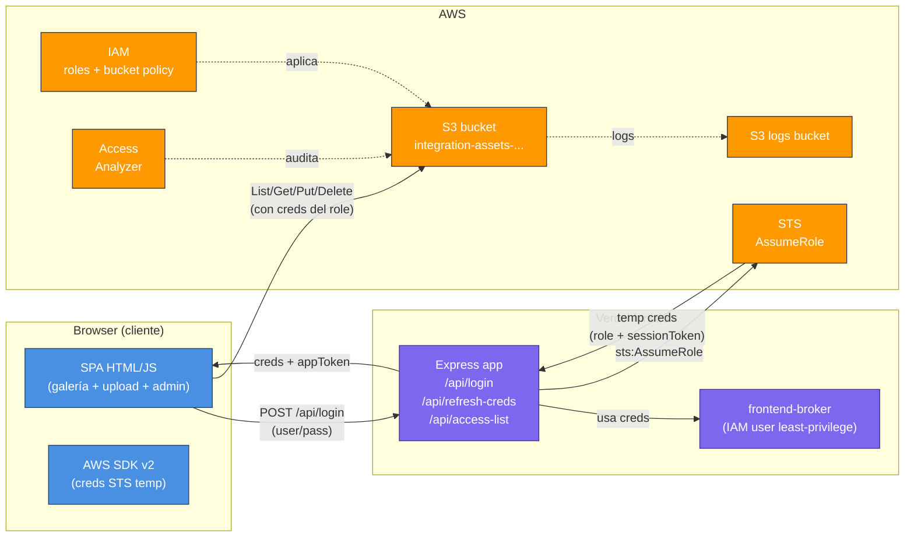
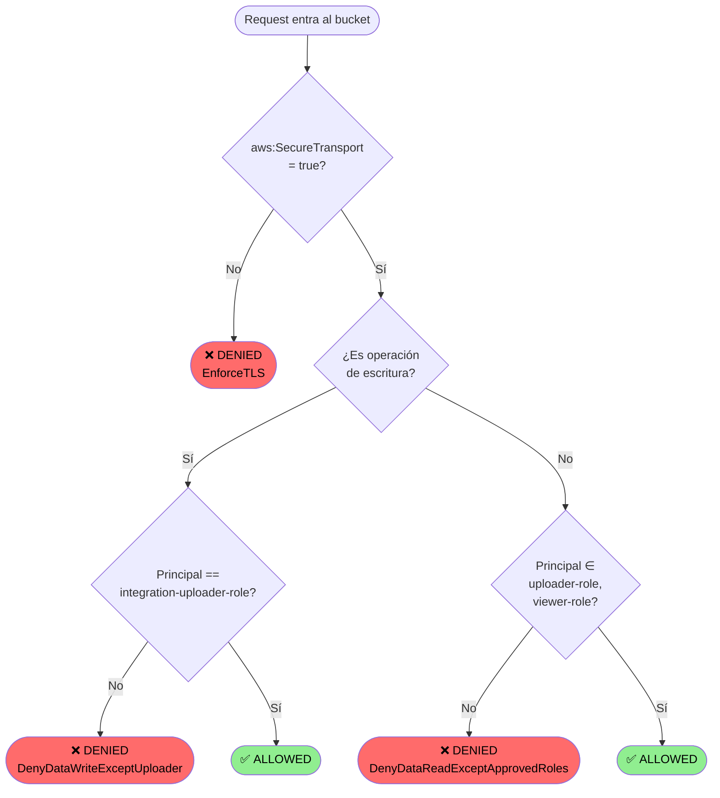
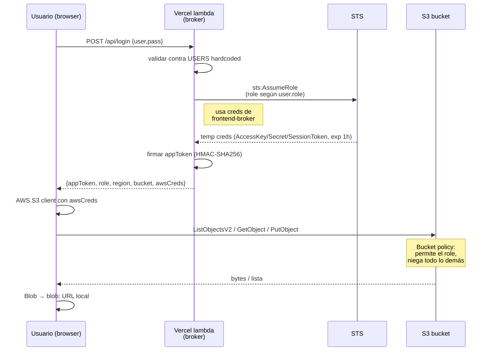
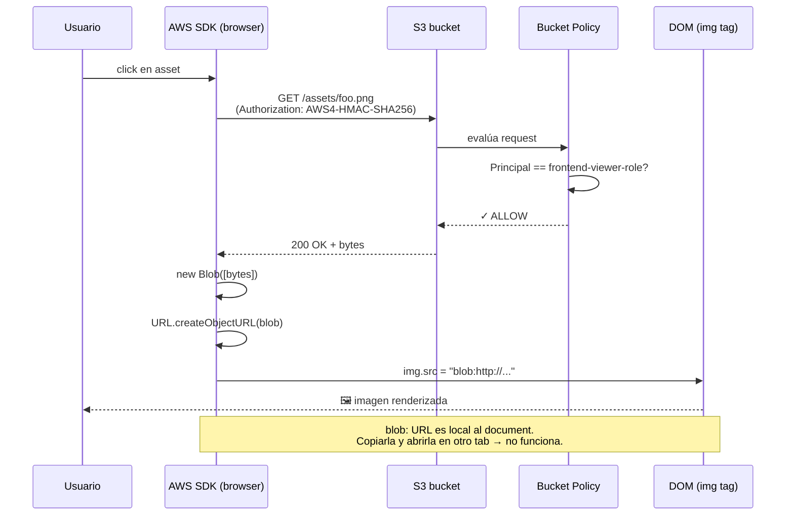
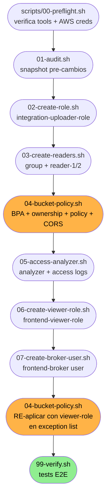

# S3 Restricted Bucket Integration

> 🇬🇧 [English version](README.md)

Integración de un bucket S3 con acceso restringido a un servicio que carga datos y a un set específico de usuarios para lectura. Solución end-to-end con frontend (Express + AWS SDK en browser), bucket hardening vía bucket policy, y broker pattern con STS para emitir credenciales temporales por usuario.

**Demo en producción:** https://s3-crud-verato-test1.jorgetrad.com

**Repositorio en Github:** https://github.com/jorgetrad99/s3-crud-verato-test1

---

## La app en acción

> Capturas tomadas de la versión desplegada en Vercel.

### 1. Login

Mismo formulario para los dos perfiles. La app autentica contra usuarios hardcoded (`admin`/`viewer`) y, al validar, llama a STS para emitir credenciales temporales del role correspondiente.


### 2. Viewer — solo lectura

`viewer` solo ve la galería paginada. Sin zona de upload, sin botones de eliminar, sin panel admin. Sus credenciales temporales corresponden al `frontend-viewer-role` que solo tiene `s3:GetObject` y `s3:ListBucket`.


### 3. Admin — vista completa

Cuando entra `admin`, aparecen tres secciones:
- Zona de upload (drag-drop)
- Tabla "Quién tiene acceso al bucket" (lee la bucket policy en vivo via `/api/access-list`)
- Galería con botón eliminar por fila


### 4. Panel de acceso (admin)

La tabla muestra exactamente los 2 principals que la bucket policy autoriza para datos, más cards informativas con el estado de Block Public Access, TLS, CORS y el grupo IAM legacy.


### 5. Drag-and-drop con preview de chips

Los archivos seleccionados aparecen como chips con tamaño y botón para quitar. El contador `X / 50` muestra la capacidad del bucket en tiempo real.


### 6. La prueba de seguridad: presigned URL firmada por `admin-cli` → 403

El test demuestra que la bucket policy se evalúa **en cada request**, no solo al firmar la URL. `admin-cli` puede generar técnicamente una URL firmada (la firma es un cómputo local, no requiere hablar con S3), pero al usarla, S3 verifica el `aws:PrincipalArn` y aplica el `Deny`.

> Nota: no funciona el camino "click Open en la consola de S3" porque después de la última policy, `admin-cli` tampoco puede listar ni abrir el bucket desde la consola web. El test va por **CLI**.

**Paso a paso:**

```bash
# 1. Obtener el key de un objeto que ya está en el bucket.
#    Caminos posibles:
#    - Login admin en la app, click cualquier asset → copia el campo "Key" del modal
#    - O navega a https://s3-crud-verato-test1.jorgetrad.com → DevTools → Network → request a S3
KEY="assets/Improvising_101.pdf"   # ejemplo

# 2. Generar el presigned URL con tus credenciales de admin-cli (perfil default).
#    `aws s3 presign` solo firma localmente, no llama a S3, así que funciona aunque
#    admin-cli esté denegado por bucket policy.
URL=$(aws s3 presign "s3://integration-assets-242032648320/${KEY}" --expires-in 300)
echo "$URL"
# Output: https://integration-assets-242032648320.s3.us-east-1.amazonaws.com/assets/...
#   ?X-Amz-Algorithm=AWS4-HMAC-SHA256
#   &X-Amz-Credential=AKIATQWSFECA.../20260507/us-east-1/s3/aws4_request
#   &X-Amz-Signature=...

# 3. Validar inmediatamente desde la terminal que la URL recién firmada SÍ falla
curl -i "$URL" | head -20
# Respuesta esperada:
#   HTTP/1.1 403 Forbidden
#   <Error>
#     <Code>AccessDenied</Code>
#     <Message>User: arn:aws:iam::242032648320:user/admin-cli is not
#       authorized to perform: s3:GetObject on resource ... with an
#       explicit deny in a resource-based policy</Message>
#   </Error>
```

**4.** Copia esa URL completa (la del paso 2) y pégala en una pestaña **Incognito / InPrivate** del browser.

**5.** El browser muestra el XML de error de S3 con `<Code>AccessDenied</Code>`. Captura esa pestaña — ese es el screenshot que prueba que la URL no funciona ni siquiera dentro de su TTL de 5 min.


> **Lo que esto prueba:** aunque la firma sea criptográficamente válida y la URL esté dentro del TTL, la bucket policy se aplica por request. Cualquier identidad **fuera de los 2 roles** (`integration-uploader-role` y `frontend-viewer-role`) recibe 403 — sin importar quién comparta el URL ni desde qué dispositivo.

> **Test contrario (opcional, demuestra que el role SÍ funciona):** asume `frontend-viewer-role`, genera la URL con esas creds temporales, pégala en incognito → **200 OK** (el role está autorizado). Útil para mostrar que el control es por identidad, no por path:
> ```bash
> CREDS=$(aws sts assume-role \
>   --role-arn arn:aws:iam::242032648320:role/frontend-viewer-role \
>   --role-session-name proof \
>   --external-id integration-upload-2025)
>
> export AWS_ACCESS_KEY_ID=$(echo "$CREDS" | python -c "import json,sys;print(json.load(sys.stdin)['Credentials']['AccessKeyId'])")
> export AWS_SECRET_ACCESS_KEY=$(echo "$CREDS" | python -c "import json,sys;print(json.load(sys.stdin)['Credentials']['SecretAccessKey'])")
> export AWS_SESSION_TOKEN=$(echo "$CREDS" | python -c "import json,sys;print(json.load(sys.stdin)['Credentials']['SessionToken'])")
>
> aws s3 presign "s3://integration-assets-242032648320/${KEY}" --expires-in 300
> # Esa URL sí funciona en incognito durante 300s.
>
> # Limpia las creds temporales del shell:
> unset AWS_ACCESS_KEY_ID AWS_SECRET_ACCESS_KEY AWS_SESSION_TOKEN
> ```

---

## Stack técnico

| Capa | Tecnología |
|---|---|
| **Frontend** | HTML/CSS/JS vanilla · AWS SDK for JavaScript **v2** (cargado por CDN, ejecuta en browser) · `<dialog>` nativo · drag-drop API · `Blob` + `URL.createObjectURL` para preview local |
| **Backend (Express)** | Node.js 20 (ESM) · Express 4 · `@aws-sdk/client-sts` (AssumeRole) · `@aws-sdk/client-iam` + `@aws-sdk/client-s3` (metadata para el panel admin) · `@aws-sdk/credential-providers` (`fromIni` para dev local) · HMAC-SHA256 (`node:crypto`) para session token · `dotenv` |
| **AWS** | S3 (bucket + lifecycle + CORS + access logging) · IAM (roles, users, groups, inline policies) · STS (AssumeRole + GetCallerIdentity) · IAM Access Analyzer · CloudTrail (opcional para data events) |
| **Provisioning** | AWS CLI v2 · scripts bash idempotentes en `scripts/` · `cygpath` para compatibilidad Git Bash en Windows · `python -m json.tool` para validación |
| **Deploy** | Vercel (function + static via `vercel.json` rewrites) · custom domain |
| **Dev tooling** | Git Bash (MINGW64) · Vercel CLI · GitHub |

---

## Visión arquitectónica




---

## El reto

Del enunciado original:

> You are performing an integration with a service that will be loading data into an AWS bucket. You are being requested to restrict the access to this bucket to only allow for the integration to input data into the bucket and for only an specific set of users to be able to access said data.
>
> - Provide a list of who and what currently has access to the bucket.
> - Make so that only the integration can add/edit files from the bucket.
> - Limit the read access so that only an specific set of users can access the bucket's information.

---

## Decisión de arquitectura

Tres opciones evaluadas:

| Opción | Pros | Contras | Veredicto |
|---|---|---|---|
| **Proxy de la app (Express con creds del bucket)** | Simple; URLs nunca salen del server | El access control queda en la app, no en AWS; AWS solo ve "una identidad" | ❌ Descartado por no cumplir el espíritu del reto (AWS-native) |
| **STS broker pattern: cada usuario asume un IAM role distinto** | AWS hace el access control real vía bucket policy + IAM; cada usuario tiene su identidad; trazabilidad por sesión | Las creds temp viven brevemente en el browser | ✅ **Elegido** |
| **CloudFront + signed cookies** | Bloquea hasta el sharing de URLs (cookie HttpOnly + SameSite) | Setup considerablemente más complejo (distribución, OAC, key pair, dominio) | ⏭️ Mencionado como evolución posible |

Con la opción elegida, **la bucket policy es el único enforcement real**; la app solo broker entre `username/password` (hardcoded para la demo) y `sts:AssumeRole`.

---

## Modelo de permisos final

### Quién tiene acceso

| Principal | Tipo | Read | Write | Propósito |
|---|---|:--:|:--:|---|
| `integration-uploader-role` | role | ✓ | ✓ | Asumido por el login admin (sube/borra) |
| `frontend-viewer-role` | role | ✓ | — | Asumido por el login viewer (solo lee) |
| `frontend-broker` | user (least-privilege) | — | — | Solo `sts:AssumeRole` sobre los 2 roles + read de metadata para el panel admin |
| `admin-cli` | user (operator) | — | — | Mantiene gestión del bucket (`PutBucketPolicy`, etc.) pero **denegado** a nivel datos por la bucket policy |
| `reader-1`, `reader-2` | users (legacy) | — | — | Bucket policy los **deniega** explícitamente — demuestra que el deny gana sobre cualquier IAM allow |
| Account `root` | n/a | — | — | También denegado a nivel datos; mantiene escape hatch vía modificación de policy |

> **Punto clave:** ningún humano tiene acceso a los datos. Solo los 2 roles asumidos por el broker pueden leer/escribir. Una presigned URL firmada por `admin-cli` o `root` retorna **403** porque la bucket policy se evalúa en cada request.

### Bucket policy (resumen)

Tres statements:

1. **`DenyDataReadExceptApprovedRoles`** — niega `s3:GetObject`, `s3:GetObjectAttributes`, `s3:GetObjectAcl`, `s3:GetObjectVersion`, `s3:ListBucket`, etc. para todo principal que no sea uno de los 2 roles.
2. **`DenyDataWriteExceptUploader`** — niega `s3:PutObject`, `s3:DeleteObject`, `s3:PutObjectAcl` para todo principal que no sea `integration-uploader-role`.
3. **`EnforceTLS`** — niega `s3:*` si `aws:SecureTransport` es false (HTTPS only).

JSON completo: [`audit-evidence/bucket-policy-applied.json`](audit-evidence/bucket-policy-applied.json) (regenerado en cada `bash scripts/04-bucket-policy.sh`).

### Cómo evalúa S3 cada request




**Punto clave:** un `Deny` en bucket policy **siempre gana** sobre cualquier `Allow` en IAM policy. Por eso `reader-1` y `reader-2`, aunque su IAM policy de grupo les permita `s3:GetObject`, son denegados a nivel bucket.

### Defense-in-depth aplicado

- **Block Public Access:** las 4 opciones ON
- **Object Ownership:** `BucketOwnerEnforced` (ACLs deshabilitadas)
- **Server access logging** → bucket separado `<bucket>-access-logs`
- **IAM Access Analyzer** habilitado a nivel cuenta
- **Bucket CORS** restringido a los origins del frontend
- **Trust policy** de los roles con `ExternalId` para evitar confused-deputy

---

## Problemas encontrados (y cómo se resolvieron)

### 1. Presigned URLs filtrables

El primer enfoque generaba URLs firmadas server-side y las pasaba al ``. Funciona, pero **cualquier persona con esa URL accede al objeto durante 5 min**, sin sesión, desde cualquier dispositivo.

**Solución:** eliminar las presigned URLs. El browser fetchea bytes via SDK con creds temporales, los convierte en `Blob`, y muestra vía `blob:` URL local (no compartible).

### 2. AWS Console permitía abrir objetos vía "Open"

La consola de AWS, al darle "Open" a un objeto, genera una presigned URL con la sesión del usuario actual (`admin-cli` en nuestro caso). Esa URL es publicable durante su TTL. La bucket policy original tenía `admin-cli` en la lista de excepciones, así que el leak existía aunque el frontend no lo expusiera.

**Solución:** la bucket policy ya no tiene a `admin-cli`/`root`/`reader-1`/`reader-2` en la lista de excepciones para datos. **Solo los 2 roles pueden hacer `s3:GetObject`.** Una presigned URL firmada por admin-cli ahora responde 403 incluso con firma válida — la bucket policy se evalúa en cada request.

### 3. Operaciones de gestión sin romper ergonomía

Si denegamos `s3:*` a admin-cli, también pierde `PutBucketPolicy`/`GetBucketPolicy`/`GetPublicAccessBlock` y los scripts de mantenimiento dejan de funcionar.

**Solución:** los `Deny` de la bucket policy listan **acciones específicas de datos** (`s3:GetObject`, `s3:ListBucket`, `s3:PutObject`, etc.) en vez de `s3:*`. Las operaciones de gestión no están en el deny, así que admin-cli sigue siendo el operator.

### 4. Broker en serverless

El backend (Express) en Vercel no puede leer `~/.aws/credentials`. Necesita creds inyectadas vía env vars. Usar las claves permanentes de admin-cli sería excesivo (tienen `s3:*` y más).

**Solución:** un IAM user **`frontend-broker`** con política mínima:
- `sts:AssumeRole` solo sobre los 2 roles
- `s3:GetBucketPolicy`/`GetBucketCors`/`GetBucketPublicAccessBlock` (para el panel admin)
- `iam:GetGroup`/`GetRole` (para el panel admin)

Sus claves van a Vercel como `ADMIN_AWS_ACCESS_KEY_ID/SECRET`. Si se filtran, el blast radius es muy reducido.

---

## Cómo se conecta la app con AWS




- El **appToken** (HMAC stateless, 8h) solo se usa para `/api/access-list` (vista admin) y `/api/refresh-creds`.
- Las **AWS temp creds** se usan directamente browser ↔ S3 vía AWS SDK.
- 2 minutos antes de expirar, el cliente hace `POST /api/refresh-creds` para renovar sin re-login.

### Flujo de visualización de un asset (sin presigned URL)




**Por qué no se filtra:** la URL en el `` es un `blob:` local del browser, válido solo dentro del documento que lo creó. El "URL real" del objeto en S3 nunca aparece como string compartible — siempre va con `Authorization` header de la request original.

---

## Recursos AWS desplegados

| Recurso | Nombre | Creado por |
|---|---|---|
| S3 bucket | `integration-assets-242032648320` | `scripts/04-bucket-policy.sh` |
| Bucket de logs | `integration-assets-242032648320-access-logs` | `scripts/05-access-analyzer.sh` |
| IAM role (uploader) | `integration-uploader-role` | `scripts/02-create-role.sh` |
| IAM role (viewer) | `frontend-viewer-role` | `scripts/06-create-viewer-role.sh` |
| IAM user (broker) | `frontend-broker` | `scripts/07-create-broker-user.sh` |
| IAM users (legacy demo) | `reader-1`, `reader-2` | `scripts/03-create-readers.sh` |
| IAM group | `s3-readers` | `scripts/03-create-readers.sh` |
| Access Analyzer | `account-bucket-analyzer` | `scripts/05-access-analyzer.sh` |

---

## Comandos usados (CLI)

Todos los scripts son **idempotentes**: re-ejecutarlos no rompe nada, salta lo que ya existe, y reaplica lo configurable.

### Orden de ejecución




> ⚠️ **Punto de no retorno:** el script `04` en su segunda corrida (después de Phase 6) aplica el `Deny` definitivo. A partir de ahí solo los 2 roles pueden tocar datos. Asegúrate de tener tu broker creado antes (Phase 7) si vas a usar la app desde Vercel.

```bash
# Variables resueltas dinámicamente desde STS GetCallerIdentity
source .envrc

# Phase 1 — Snapshot del estado actual del bucket / IAM (antes de cambios)
bash scripts/01-audit.sh
# Output: audit-evidence/{bucket-policy-before.json, iam-users.txt, iam-roles.txt, ...}

# Phase 2 — Role para uploads (asumido por el login admin)
bash scripts/02-create-role.sh
# Crea: integration-uploader-role
# Inline policy: s3:PutObject, DeleteObject, GetObject, ListBucket en el bucket
# Trust policy: AccountRoot + condition StringEquals sts:ExternalId

# Phase 3 — IAM users + grupo legacy (demo de defense-in-depth)
bash scripts/03-create-readers.sh
# Crea: s3-readers group, reader-1, reader-2
# Inline policy del grupo: s3:GetObject, ListBucket
# (Estos users serán DENEGADOS por la bucket policy en Phase 4 — defense-in-depth)

# Phase 4 — Hardening del bucket
bash scripts/04-bucket-policy.sh
# - Block Public Access ON (las 4 opciones)
# - Object Ownership: BucketOwnerEnforced
# - Bucket policy: 3 statements (DenyDataReadExceptApprovedRoles, DenyDataWriteExceptUploader, EnforceTLS)
# - CORS: solo $FRONTEND_ORIGINS

# Phase 5 — Audit + logging
bash scripts/05-access-analyzer.sh
# - IAM Access Analyzer (Account-level)
# - Bucket de access logs + server access logging activado

# Phase 6 — Role para read-only (asumido por el login viewer)
bash scripts/06-create-viewer-role.sh
# Crea: frontend-viewer-role
# Inline policy: s3:GetObject, ListBucket (NO write)

# Phase 7 — Broker user para Vercel (least-privilege)
bash scripts/07-create-broker-user.sh
# Crea: frontend-broker
# Inline policy: sts:AssumeRole sobre los 2 roles + iam:GetGroup/GetRole + s3:GetBucket{Policy,Cors,PublicAccessBlock}
# Genera access keys → audit-evidence/frontend-broker-keys.json (chmod 600)
```

### Lectura del estado vivo

```bash
# Ver bucket policy actual
aws s3api get-bucket-policy --bucket $BUCKET --query Policy --output text | python -m json.tool

# Ver Block Public Access
aws s3api get-public-access-block --bucket $BUCKET

# Ver CORS
aws s3api get-bucket-cors --bucket $BUCKET

# Verificar que admin-cli está denegado a leer datos
aws s3 ls s3://$BUCKET/   # → AccessDenied

# Verificar que el role asumido sí puede leer
aws sts assume-role --role-arn arn:aws:iam::$ACCOUNT_ID:role/$VIEWER_ROLE_NAME \
  --role-session-name test --external-id $EXTERNAL_ID
# (luego export AWS_ACCESS_KEY_ID, SECRET, SESSION_TOKEN y aws s3 ls $BUCKET → OK)
```

---

## Cómo hacerlo desde la AWS Console (UI)

Aquí los pasos equivalentes para hacer cada cosa por la consola web.

### Phase 1 — Auditar el estado actual del bucket

1. **S3** → seleccionar el bucket → tab **Permissions**
2. Capturar el JSON de **Bucket policy** (puede estar vacío)
3. Revisar **Block public access**, **Access Control List**, **Object Ownership**
4. **IAM** → **Users** y **Roles** → exportar listas

> 📸 _Screenshot: tab Permissions del bucket_  
> 

> 📸 _Screenshot: Bucket policy en JSON_  
> 

> 📸 _Screenshot: lista de IAM users / roles_  
> 
> 

---

### Phase 2 — Crear el role uploader (`integration-uploader-role`)

1. **IAM** → **Roles** → **Create role**
2. *Trusted entity type:* **AWS account** → **This account**
3. Marcar **Require external ID** y poner `integration-upload-2025`
4. **Next** → omitir attach permissions (las haremos inline)
5. *Role name:* `integration-uploader-role` → **Create role**
6. Abrir el role → **Permissions** → **Add permissions** → **Create inline policy**
7. Tab **JSON** → pegar el contenido de `scripts/02-create-role.sh` (sección permission policy)
8. *Name:* `S3UploadPolicy` → **Create policy**
---

### Phase 3 — Crear group `s3-readers` + users `reader-1`, `reader-2`

1. **IAM** → **User groups** → **Create group** → name `s3-readers`
2. Skip attach permissions; **Create group**
3. Abrir el group → **Permissions** → **Add permissions** → **Create inline policy** → JSON con `s3:GetObject` + `s3:ListBucket` sobre el bucket → name `S3ReadOnlyAccess`
4. **IAM** → **Users** → **Create user**
5. Username: `reader-1` → **Add user to group** → marcar `s3-readers` → **Create user**
6. Abrir `reader-1` → **Security credentials** → **Create access key** → *Application running outside AWS* → guardar el .csv
7. Repetir para `reader-2`

> 📸 _Screenshot: grupo con inline policy_  
> 

> 📸 _Screenshot: user en el grupo_  
> 

---

### Phase 4 — Bucket hardening

1. **S3** → bucket → **Permissions** → **Block public access (bucket settings)** → **Edit** → marcar las 4 → **Save**
2. **Object Ownership** → **Edit** → seleccionar **ACLs disabled (recommended)** → **Save**
3. **Bucket policy** → **Edit** → pegar el JSON de las 3 statements (con tu Account ID y bucket sustituidos) → **Save changes**
4. **CORS configuration** → **Edit** → pegar el array de `CORSRules` con tus origins → **Save changes**

> 📸 _Screenshot: Block Public Access ON_  
> 

> 📸 _Screenshot: bucket policy JSON aplicada_  
> 

> 📸 _Screenshot: CORS rules_  
> 

---

### Phase 5 — Access Analyzer + server access logging

1. **IAM** → **Access Analyzer** → **Analyzers** → **Create analyzer**
2. *Type:* **Account analyzer** → name `account-bucket-analyzer` → **Create**
3. **S3** → crear el bucket de logs `<bucket>-access-logs` (Block Public Access ON desde el inicio)
4. Ir al bucket original → **Properties** → **Server access logging** → **Edit** → **Enable** → target `<bucket>-access-logs/logs/` → **Save**

> 📸 _Screenshot: Access Analyzer findings_  
> 

> 📸 _Screenshot: server access logging activado_  
> 

---

### Phase 6 — Crear el role viewer (`frontend-viewer-role`)

Mismos pasos que Phase 2, pero:
- *Role name:* `frontend-viewer-role`
- Inline policy con SOLO `s3:GetObject`, `s3:GetObjectAttributes`, `s3:ListBucket`, `s3:GetBucketLocation` (sin write)
- *Description:* `Frontend viewer (read-only) role assumed via STS`

> 📸 _Screenshot: viewer role summary_  
> 

---

### Phase 7 — Crear el broker user (`frontend-broker`)

1. **IAM** → **Users** → **Create user** → name `frontend-broker`
2. **Do NOT** add to any group; skip attach policies
3. Abrir el user → **Permissions** → **Add permissions** → **Create inline policy** → JSON con `sts:AssumeRole` sobre los 2 role ARNs + las 3 s3:GetBucket* + iam:GetGroup/GetRole → name `FrontendBrokerPolicy`
4. **Security credentials** → **Create access key** → *Application running outside AWS* → guardar el `.csv` (lo necesitarás para Vercel)

> 📸 _Screenshot: broker user inline policy_  
> 

---

## Cómo correr la app

### Local

```bash
# 1. Instalar deps del server
cd frontend-app/server
npm install

# 2. .env del server (copiar de .env.example, rellenar)
cp .env.example .env
# Editar BUCKET_NAME, ROLE_ARN, VIEWER_ROLE_ARN, TOKEN_SECRET, AWS_ADMIN_PROFILE

# 3. Levantar
npm start
# → http://localhost:3001
```

Login:
- `admin` / `admin1234` → asume `integration-uploader-role` (read+write)
- `viewer` / `viewer1234` → asume `frontend-viewer-role` (read-only)

### Vercel

Ya desplegado en https://s3-crud-verato-test1.jorgetrad.com (alias del proyecto `s3-crud-verato`).

Pasos del setup (one-time):

```bash
cd frontend-app
vercel link --project s3-crud-verato

# Subir las 11 env vars desde audit-evidence/vercel.env
while IFS='=' read -r key value; do
  [ -z "$key" ] && continue
  printf '%s' "$value" | vercel env add "$key" production --force
done < ../audit-evidence/vercel.env

vercel deploy --prod
```

Tras el primer deploy, añadir el dominio Vercel a `FRONTEND_ORIGINS` en `.envrc` y re-correr `bash scripts/04-bucket-policy.sh` para actualizar el CORS del bucket.

---

## Verificación

```bash
bash scripts/99-verify.sh
```

Tests automáticos (todos deben PASS):
- Reader puede listar
- Reader **no** puede subir
- Conexión HTTP plain rechazada (TLS condition)
- Role puede subir vía AssumeRole
- Block Public Access ON
- Bucket policy presente
- Access Analyzer existe

Tests manuales recomendados desde browser:
1. Login `viewer` → galería carga
2. Logout, login `admin` → ves "Quién tiene acceso al bucket" + zona de upload
3. **Pegar la URL de un objeto vía console "Open" en pestaña incognito** → debe dar **403** (admin-cli denegado)
4. DevTools Network → verificar que las requests a S3 NO tienen `X-Amz-Signature` en la URL (solo en headers Authorization)

---

## Cleanup

```bash
bash scripts/cleanup.sh
# Pide escribir literal "DELETE" para confirmar
# Borra: bucket + contenido, bucket de logs, IAM users, group, roles, analyzer
```

---

## Estructura del repo

```
.
├── README.md                              # este archivo
├── .envrc                                 # variables resueltas dinámicamente
├── scripts/
│   ├── lib.sh                             # helpers compartidos
│   ├── 00-preflight.sh                    # check tools + AWS auth
│   ├── 01-audit.sh                        # snapshots pre-cambios
│   ├── 02-create-role.sh                  # uploader role
│   ├── 03-create-readers.sh               # legacy IAM users + group
│   ├── 04-bucket-policy.sh                # hardening + CORS
│   ├── 05-access-analyzer.sh              # analyzer + logging
│   ├── 06-create-viewer-role.sh           # viewer role
│   ├── 07-create-broker-user.sh           # broker user para Vercel
│   ├── 99-verify.sh                       # E2E tests
│   └── cleanup.sh                         # tear-down
├── frontend-app/
│   ├── api/index.js                       # Vercel function entry
│   ├── server/
│   │   ├── index.js                       # Express app: login + AssumeRole + access-list
│   │   ├── package.json
│   │   └── .env.example
│   ├── client/
│   │   ├── index.html                     # SPA: login, gallery, upload, access-list
│   │   ├── app.js                         # AWS SDK v2 → S3 directo desde browser
│   │   └── style.css
│   ├── package.json                       # deps para Vercel function
│   └── vercel.json                        # rewrites
└── audit-evidence/                        # gitignored — snapshots + access keys + logs
```
